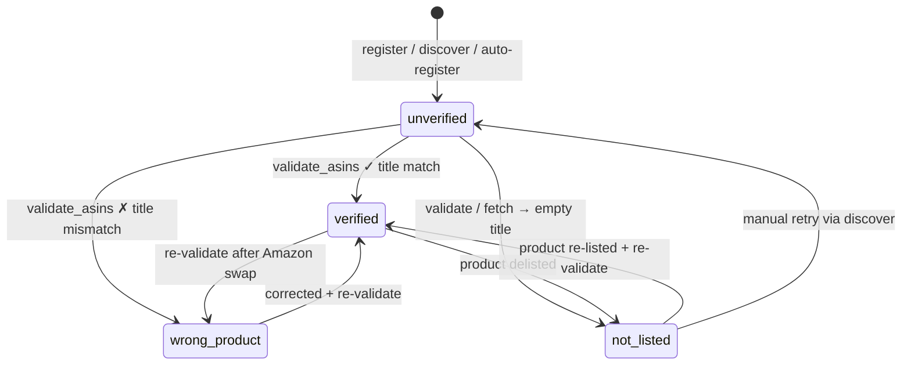

# Plan: product_asins.status Cleanup (Path B 最小补丁)

## Summary

修补 `product_asins.status` 字段三件事：(1) Schema migration v5 删除僵尸状态 `unavailable`；(2) 把 `not_listed` 加入查询过滤门并让 `_resolve_asin` 在遇到 `wrong_product` / `not_listed` 时直接 raise（修复 query lifecycle matrix #10 silent failure）；(3) schema 注释 + DEVELOPER.md 写清 4 个状态语义和触发事件矩阵。完整的状态机重构（拆 validation_status + monitoring_status、Enum、transition table）推迟到 Phase 3 PRD。

## User Story

As a amz-scout 用户（Jack 单用户 + 未来 Web 多用户），
I want 在查询失效或被验证为错误的 ASIN 时收到明确的结构化错误，而不是静默返回空数据，
So that 我能区分"该市场无数据" vs "ASIN 已下架/错配"，避免基于错误数据做商业决策（如 BE10000 类分析）。

## Problem → Solution

**当前**：`product_asins.status` CHECK 允许 5 值但 `unavailable` 无任何写入路径（僵尸）；唯一查询过滤门只排除 `wrong_product`，`not_listed` 的 ASIN 仍被 Phase A 拿去 fetch，返回空数据无 error，用户无从分辨。

**之后**：CHECK 收紧到 4 值；查询过滤门扩为 `status NOT IN ('wrong_product', 'not_listed')`；`_resolve_asin` 在 ASIN pass-through 路径主动检查 status 并 raise 结构化 ValueError；DEVELOPER.md 文档化 4 状态语义 + mermaid 状态图。

## Metadata

- **Complexity**: Small-Medium
- **Source PRD**: N/A（来自 council 决策 + query-lifecycle-matrix audit）
- **PRD Phase**: standalone — Phase 3 backlog 之前的 P0 修复
- **Estimated Files**: 5（db.py + api.py + tests/test_db.py + tests/test_api.py + docs/DEVELOPER.md）

---

## UX Design

Internal change — no user-facing UI. 但对 API 调用方有可见行为变化：

### Before
```
query_trends(product="B0DEAD12345", marketplace="UK")
  → status='not_listed' 被忽略
  → Keepa 查询返回空 rows
  → envelope {"ok": True, "data": [], "meta": {"hint": "..."}}
  → 用户以为"该市场无数据"
```

### After
```
query_trends(product="B0DEAD12345", marketplace="UK")
  → _resolve_asin 读取 status='not_listed'
  → raise ValueError("ASIN B0DEAD12345 marked not_listed for UK ...")
  → envelope {"ok": False, "error": "ASIN ... not_listed ...", "data": []}
  → 用户明确知道"ASIN 已失效，需要 discover 新 ASIN"
```

### Interaction Changes

| Touchpoint | Before | After | Notes |
|---|---|---|---|
| `query_trends("<not_listed_asin>")` | `{"ok": True, "data": []}` | `{"ok": False, "error": "...", "data": []}` | **行为变化**：原本静默成功现在显式失败 |
| `query_trends("<wrong_product_asin>")` | `_resolve_asin` 通过 + 查询返回空 | `raise ValueError` → envelope 失败 | 与 `wrong_product` 现有 SQL 过滤一致 |
| `load_products_from_db(marketplace=...)` | 排除 `wrong_product` | 排除 `wrong_product` 和 `not_listed` | 列表 API 也不再返回失效 ASIN |
| `validate_asins()` | 仍可标记 `not_listed` | 不变 | 标记功能保留 |

---

## Mandatory Reading

| Priority | File | Lines | Why |
|---|---|---|---|
| P0 | `src/amz_scout/db.py` | 105 | `SCHEMA_VERSION = 4` 常量 — 升 5 |
| P0 | `src/amz_scout/db.py` | 171–272 | `_migrate()` — 现有 v2/v3/v4 模式，v5 加在 if current < 5 块 |
| P0 | `src/amz_scout/db.py` | 218–238 | v3 init 中的 CHECK 约束 — 不能改（历史 migration 必须维持原状）|
| P0 | `src/amz_scout/db.py` | 275–286 | `_SCHEMA_SQL` 的 schema_migrations 插入序列 — v5 也要加一行 INSERT |
| P0 | `src/amz_scout/db.py` | 436–449 | `_SCHEMA_SQL` 中 `product_asins` CHECK — **要修改**：去掉 `unavailable` |
| P0 | `src/amz_scout/db.py` | 1462, 1488 | 查询过滤门 — **要修改**：`!= 'wrong_product'` → `NOT IN ('wrong_product', 'not_listed')` |
| P0 | `src/amz_scout/api.py` | 216–302 | `_resolve_asin` — **要修改**：ASIN pass-through 路径加 status 检查 |
| P1 | `src/amz_scout/api.py` | 354–376 | `_try_mark_not_listed` — 写入 `not_listed` 的入口，要保留 |
| P1 | `src/amz_scout/api.py` | 481–587 | `query_trends` — try/except 已包 _resolve_asin，新 ValueError 自动转 envelope |
| P1 | `src/amz_scout/db.py` | 1522–1537 | `update_asin_status` — 状态写入单入口 |
| P2 | `tests/test_db.py` | 28–69 | TestSchema 模式（idempotent + version 检查）|
| P2 | `tests/test_api.py` | 880–906 | `test_empty_title_marks_not_listed` — 写入测试参考 |
| P2 | `tests/test_core_flows.py` | 27–36 | `conn` fixture 模式（:memory: SQLite）|
| P2 | `.claude/PRPs/reports/query-lifecycle-matrix.md` | §5 #10/#12, §6 P0 | 决策依据 |

## External Documentation

No external research needed — feature uses established internal patterns (sqlite3 + pytest).

---

## Patterns to Mirror

### MIGRATION_PATTERN
```python
# SOURCE: src/amz_scout/db.py:254–266 (v4 migration)
if current < 4:
    cols = [r["name"] for r in conn.execute("PRAGMA table_info(keepa_products)")]
    if "fetch_mode" not in cols:
        conn.execute(
            "ALTER TABLE keepa_products "
            "ADD COLUMN fetch_mode TEXT NOT NULL DEFAULT 'basic'"
        )
    conn.execute(
        "INSERT OR IGNORE INTO schema_migrations (version, description) "
        "VALUES (4, 'add fetch_mode to keepa_products')"
    )
    logger.info("Migrated schema to version 4")
```
**关键**：整个 `_migrate()` 已在 `with conn:` (db.py:180) 包了 transaction。`INSERT OR IGNORE` 保证幂等。SQLite CHECK 约束修改需要 `ALTER TABLE ... RENAME` + 重建（CHECK 不能 ALTER）。

### CHECK_CONSTRAINT_REBUILD_PATTERN
SQLite 不支持直接 ALTER CHECK。标准做法：
```python
conn.execute("ALTER TABLE product_asins RENAME TO product_asins_old")
conn.execute("CREATE TABLE product_asins (... CHECK(status IN ('unverified', ...)) ...)")
conn.execute("INSERT INTO product_asins SELECT * FROM product_asins_old")
conn.execute("DROP TABLE product_asins_old")
conn.execute("CREATE INDEX idx_pa_asin ON product_asins(asin)")
```

### ERROR_RAISE_PATTERN
```python
# SOURCE: src/amz_scout/api.py:301-302
if db_warnings:
    raise ValueError(f"Product not found: {query_str}. {db_warnings[0]}")
raise ValueError(f"Product not found: {query_str}")
```
**模式**：`_resolve_asin` 内部用 `raise ValueError(...)`，外层 `query_*` 的 `except Exception as e: return _envelope(False, error=str(e))` 自动转结构化失败。

### STATUS_QUERY_FILTER_PATTERN
```python
# SOURCE: src/amz_scout/db.py:1462, 1488
wheres.append("pa.marketplace = ? AND pa.status != 'wrong_product'")
f"AND status != 'wrong_product'",
```

### TEST_FIXTURE_PATTERN
```python
# SOURCE: tests/test_core_flows.py:27-36
@pytest.fixture
def conn():
    """In-memory SQLite connection with schema initialized."""
    c = sqlite3.connect(":memory:")
    c.execute("PRAGMA journal_mode = WAL")
    c.execute("PRAGMA foreign_keys = ON")
    c.row_factory = sqlite3.Row
    init_schema(c)
    yield c
    c.close()
```

### TEST_CLASS_STRUCTURE
```python
# SOURCE: tests/test_db.py:46-69
class TestSchema:
    def test_init_schema_creates_tables(self, conn):
        ...
    def test_init_schema_idempotent(self, conn):
        ...
    def test_schema_version(self, conn):
        ...
```

### LOGGER_PATTERN
```python
# SOURCE: src/amz_scout/db.py:20, 252, 268-271
logger = logging.getLogger(__name__)
logger.info("Migrated schema to version 3")
logger.exception(
    "Schema migration failed at version %d. Database may need manual repair.",
    current,
)
```

---

## Files to Change

| File | Action | Justification |
|---|---|---|
| `src/amz_scout/db.py` | UPDATE | (a) `SCHEMA_VERSION = 5`; (b) v5 migration block in `_migrate()`; (c) `_SCHEMA_SQL` 的 product_asins CHECK 收紧 + 加 inline status 注释 + 新增 schema_migrations v5 INSERT; (d) 两处查询过滤门扩展 |
| `src/amz_scout/api.py` | UPDATE | `_resolve_asin` 在 ASIN pass-through 路径加 status 检查并 raise 结构化 ValueError；db registry hit 路径同样检查 |
| `tests/test_db.py` | UPDATE | (a) `test_schema_version` 改 `== 5`; (b) `test_init_schema_idempotent` 改 `== 5`; (c) 新增 `TestStatusMigrationV5` class |
| `tests/test_api.py` | UPDATE | 新增 `TestResolveAsinStatusGate` class（覆盖 not_listed/wrong_product 拒绝）|
| `docs/DEVELOPER.md` | UPDATE | 新增 `## ASIN Status Semantics` 小节（4 状态表 + 触发事件矩阵 + mermaid 状态图）|
| `.claude/PRPs/prds/amz-scout-slim-refactor.prd.md` | UPDATE（可选）| 在 backlog 末尾追加 Phase 3 open questions |

## NOT Building

- 不拆 `validation_status` + `monitoring_status` 两列
- 不加 Python `Enum` 或 transition table
- 不加 `stale` / `paused` / `archived` 新状态
- 不修矩阵 #8（ASIN 市场错配 silent failure）— 单独 plan
- 不修矩阵 #1/#6（cache 新鲜度门）— Phase 3
- 不在代码层强制状态转移合法性 — 信任 `update_asin_status()` 单入口
- 不为 `not_listed` ASIN 提供"自动 re-fetch 复活"机制 — 用户须显式调 `discover_asin()`

---

## Step-by-Step Tasks

### Task 1: 升 SCHEMA_VERSION 到 5

- **ACTION**: 修改 `src/amz_scout/db.py:105` 把 `SCHEMA_VERSION = 4` 改为 `SCHEMA_VERSION = 5`
- **IMPLEMENT**: 单行修改
- **MIRROR**: N/A（常量更新）
- **IMPORTS**: 无
- **GOTCHA**: 修改后所有现有 DB 文件下次 boot 都会触发 v5 migration —— 必须先完成 Task 2 才能跑测试
- **VALIDATE**: `grep "SCHEMA_VERSION" src/amz_scout/db.py` 显示 `= 5`

### Task 2: 在 `_migrate()` 加 v5 块（删除 unavailable + CHECK 重建）

- **ACTION**: 在 `src/amz_scout/db.py:266` 之后（v4 块之后），加入 v5 块
- **IMPLEMENT**:
```python
if current < 5:
    # v5: drop zombie 'unavailable' status; tighten CHECK to 4 values.
    # SQLite cannot ALTER CHECK constraints — must rebuild table.

    # Sanity check: defensive against undocumented writes
    bad = conn.execute(
        "SELECT COUNT(*) AS c FROM product_asins WHERE status = 'unavailable'"
    ).fetchone()
    if bad and bad["c"] > 0:
        raise RuntimeError(
            f"Migration v5: found {bad['c']} rows with status='unavailable'. "
            "Manual cleanup required before applying v5."
        )

    # Rebuild table with tightened CHECK
    conn.execute("ALTER TABLE product_asins RENAME TO product_asins_v4_old")
    conn.execute("""
        CREATE TABLE product_asins (
            product_id      INTEGER NOT NULL
                REFERENCES products(id) ON DELETE CASCADE,
            marketplace     TEXT NOT NULL,
            asin            TEXT NOT NULL,
            -- Status semantics (see docs/DEVELOPER.md "ASIN Status Semantics"):
            --   unverified    : registered but not yet validated against Keepa title
            --   verified      : Keepa title matches expected brand+model
            --   wrong_product : Keepa title disagrees with brand+model (likely mis-mapped ASIN)
            --   not_listed    : Keepa returned empty title (ASIN dead/removed on Amazon)
            -- Phase A queries reject 'wrong_product' and 'not_listed' to prevent silent empty results.
            status          TEXT NOT NULL DEFAULT 'unverified'
                CHECK(status IN (
                    'unverified','verified','wrong_product','not_listed'
                )),
            notes           TEXT NOT NULL DEFAULT '',
            last_checked    TEXT,
            created_at      TEXT NOT NULL
                DEFAULT (strftime('%Y-%m-%dT%H:%M:%SZ', 'now')),
            updated_at      TEXT NOT NULL
                DEFAULT (strftime('%Y-%m-%dT%H:%M:%SZ', 'now')),
            PRIMARY KEY (product_id, marketplace)
        )
    """)
    conn.execute(
        "INSERT INTO product_asins "
        "(product_id, marketplace, asin, status, notes, last_checked, created_at, updated_at) "
        "SELECT product_id, marketplace, asin, status, notes, last_checked, created_at, updated_at "
        "FROM product_asins_v4_old"
    )
    conn.execute("DROP TABLE product_asins_v4_old")
    conn.execute("CREATE INDEX idx_pa_asin ON product_asins(asin)")

    conn.execute(
        "INSERT OR IGNORE INTO schema_migrations (version, description) "
        "VALUES (5, 'drop zombie unavailable status from product_asins.CHECK')"
    )
    logger.info("Migrated schema to version 5")
```
- **MIRROR**: `MIGRATION_PATTERN` (v4) + `CHECK_CONSTRAINT_REBUILD_PATTERN`
- **IMPORTS**: 无新增
- **GOTCHA**: (1) `_migrate` 已在 `with conn:` 包裹（db.py:180），整个 v5 块享受 transaction；(2) `idx_pa_asin` 索引在 RENAME 时自动跟旧表，必须重建；(3) sanity check 用 `RuntimeError`（不是 ValueError），因为这是不可恢复的数据漂移；(4) PRIMARY KEY 是组合键且 INSERT 是原子复制，不需要关闭 foreign_keys
- **VALIDATE**: 跑测试 `pytest tests/test_db.py::TestSchema -v`，期望 version == 5

### Task 3: 同步更新 `_SCHEMA_SQL`（fresh DB 路径）

- **ACTION**: 修改 `src/amz_scout/db.py:436–449` 的 `product_asins` CHECK + 添加 inline 注释；并在 `_SCHEMA_SQL` 顶部 schema_migrations INSERT 序列追加 v5 行
- **IMPLEMENT**:
```sql
-- 在 _SCHEMA_SQL 中，schema_migrations 部分追加：
INSERT INTO schema_migrations (version, description)
    VALUES (5, 'drop zombie unavailable status from product_asins.CHECK');

-- product_asins CHECK 改为 4 值，并加 inline 注释：
CREATE TABLE product_asins (
    product_id      INTEGER NOT NULL REFERENCES products(id) ON DELETE CASCADE,
    marketplace     TEXT NOT NULL,
    asin            TEXT NOT NULL,
    -- Status semantics (see docs/DEVELOPER.md "ASIN Status Semantics"):
    --   unverified    : registered but not yet validated against Keepa title
    --   verified      : Keepa title matches expected brand+model
    --   wrong_product : Keepa title disagrees with brand+model (likely mis-mapped ASIN)
    --   not_listed    : Keepa returned empty title (ASIN dead/removed on Amazon)
    status          TEXT NOT NULL DEFAULT 'unverified'
                    CHECK(status IN (
                        'unverified','verified','wrong_product','not_listed'
                    )),
    notes           TEXT NOT NULL DEFAULT '',
    last_checked    TEXT,
    created_at      TEXT NOT NULL DEFAULT (strftime('%Y-%m-%dT%H:%M:%SZ', 'now')),
    updated_at      TEXT NOT NULL DEFAULT (strftime('%Y-%m-%dT%H:%M:%SZ', 'now')),
    PRIMARY KEY (product_id, marketplace)
);
```
- **MIRROR**: 现有 `_SCHEMA_SQL` 的 SQL 缩进与注释风格（db.py:275–457）
- **IMPORTS**: 无
- **GOTCHA**: **不要修改 v3 init block (db.py:218–238) 的 CHECK** —— 那是历史 migration，必须维持原状（CHECK 由 v5 重建覆盖）；只修 `_SCHEMA_SQL`（fresh DB 一步建好）
- **VALIDATE**: 在 :memory: 上 `init_schema(conn)` 后 `PRAGMA table_info(product_asins)` 输出包含新 CHECK；尝试 `INSERT ... status='unavailable'` 应报 IntegrityError

### Task 4: 修矩阵 #10 — 扩展 SQL 查询过滤门

- **ACTION**: 修改 `src/amz_scout/db.py:1462` 和 `db.py:1488` 两处过滤
- **IMPLEMENT**:
```python
# db.py:1462（在 load_products_from_db 内）
wheres.append("pa.marketplace = ? AND pa.status NOT IN ('wrong_product', 'not_listed')")

# db.py:1488（同函数 ASIN 映射查询）
f"AND status NOT IN ('wrong_product', 'not_listed')",
```
- **MIRROR**: `STATUS_QUERY_FILTER_PATTERN` 风格保持
- **IMPORTS**: 无
- **GOTCHA**: SQL 字符串拼接而非 parameterized — 因为是常量集合，无注入风险；保持与现有写法一致
- **VALIDATE**: 单元测试覆盖：插入 `not_listed` 行后 `load_products_from_db(marketplace=...)` 不应返回该行

### Task 5: 修矩阵 #10/#12 — `_resolve_asin` 主动检查 status 并 raise

- **ACTION**: 修改 `src/amz_scout/api.py:216–302` 的 `_resolve_asin`
- **IMPLEMENT**: 在两处加 status 检查：

  **(a) DB registry hit 路径**（约 api.py:236 之前）：
  ```python
  row = find_product(conn, query_str, marketplace)
  if row and row.get("asin"):
      # NEW: status gate (defense-in-depth — find_product already filters via Task 4)
      if row.get("marketplace"):
          status_row = conn.execute(
              "SELECT status FROM product_asins "
              "WHERE asin = ? AND marketplace = ?",
              (row["asin"], row["marketplace"]),
          ).fetchone()
          if status_row and status_row["status"] in ("wrong_product", "not_listed"):
              raise ValueError(
                  f"ASIN {row['asin']} for {marketplace} is marked "
                  f"'{status_row['status']}'. Run discover_asin() to find a valid ASIN, "
                  "or update_asin_status() if this was a mistake."
              )
      return row["asin"], row["model"], row.get("brand", ""), "db", []
  ```

  **(b) ASIN pass-through 路径**（约 api.py:264 后，在 cross-marketplace check 前）：
  ```python
  candidate = query_str.upper().strip()
  if _ASIN_RE.match(candidate):
      warnings: list[str] = []

      # NEW: status gate — if this raw ASIN is registered with bad status, refuse
      if conn is not None and marketplace:
          status_row = conn.execute(
              "SELECT status FROM product_asins WHERE asin = ? AND marketplace = ?",
              (candidate, marketplace),
          ).fetchone()
          if status_row and status_row["status"] in ("wrong_product", "not_listed"):
              raise ValueError(
                  f"ASIN {candidate} for {marketplace} is marked "
                  f"'{status_row['status']}'. Run discover_asin() for a valid ASIN, "
                  "or update_asin_status() if this was misclassified."
              )

      # ... existing non-B prefix warning ...
      # ... existing cross-marketplace warning ...
  ```
- **MIRROR**: `ERROR_RAISE_PATTERN` (api.py:301)
- **IMPORTS**: 无新增（sqlite3.Connection 已在 signature）
- **GOTCHA**: (1) `find_product()` 当 marketplace 命中时已在 JOIN 里过滤 `wrong_product`/`not_listed`（修了 Task 4 后），所以 path (a) 的 status 检查理论上不会触发——但保留作为 defense-in-depth；(2) path (b) 是关键修复路径——ASIN pass-through 没经过 `find_product`，必须自查；(3) error 信息要 actionable（告诉用户怎么办）；(4) 不要在 raise 前 logger.warning，外层 query_* 的 `logger.exception` 会处理
- **VALIDATE**: `pytest tests/test_api.py::TestResolveAsinStatusGate -v`

### Task 6: 新增测试 — Migration v5 idempotency

- **ACTION**: 在 `tests/test_db.py` 末尾新增 `TestStatusMigrationV5` class
- **IMPLEMENT**:
```python
class TestStatusMigrationV5:
    """Verify schema v5 migration: drop zombie 'unavailable' status."""

    def test_v5_check_constraint_rejects_unavailable(self, conn):
        from amz_scout.db import register_product
        pid, _ = register_product(conn, "Router", "Test", "M1")
        with pytest.raises(sqlite3.IntegrityError):
            conn.execute(
                "INSERT INTO product_asins (product_id, marketplace, asin, status) "
                "VALUES (?, 'UK', 'B0AAAAAAAA', 'unavailable')",
                (pid,),
            )

    def test_v5_check_constraint_accepts_four_values(self, conn):
        from amz_scout.db import register_product
        pid, _ = register_product(conn, "Router", "Test", "M2")
        for i, status in enumerate(["unverified", "verified", "wrong_product", "not_listed"]):
            conn.execute(
                "INSERT INTO product_asins (product_id, marketplace, asin, status) "
                "VALUES (?, ?, ?, ?)",
                (pid, f"MK{i}", f"B0BBBB{i:04d}", status),
            )

    def test_v5_idempotent(self, conn):
        from amz_scout.db import init_schema
        init_schema(conn)  # second call
        row = conn.execute(
            "SELECT COUNT(*) AS c FROM schema_migrations WHERE version = 5"
        ).fetchone()
        assert row["c"] == 1

    def test_v5_preserves_existing_rows(self, tmp_path):
        """Simulate v4 → v5 upgrade: existing rows must survive table rebuild."""
        import sqlite3
        from amz_scout.db import init_schema, register_product, register_asin

        db_path = tmp_path / "v4tov5.db"

        import amz_scout.db as db_mod
        original_version = db_mod.SCHEMA_VERSION
        try:
            db_mod.SCHEMA_VERSION = 4
            db_mod._schema_initialized.discard(str(db_path))
            c1 = sqlite3.connect(str(db_path))
            c1.row_factory = sqlite3.Row
            init_schema(c1)
            pid, _ = register_product(c1, "R", "B", "M")
            register_asin(c1, pid, "UK", "B0SURVIVE1", status="verified", notes="kept")
            c1.close()
        finally:
            db_mod.SCHEMA_VERSION = original_version
            db_mod._schema_initialized.discard(str(db_path))

        c2 = sqlite3.connect(str(db_path))
        c2.row_factory = sqlite3.Row
        init_schema(c2)
        row = c2.execute(
            "SELECT asin, status, notes FROM product_asins WHERE marketplace = 'UK'"
        ).fetchone()
        assert row["asin"] == "B0SURVIVE1"
        assert row["status"] == "verified"
        assert row["notes"] == "kept"
        version = c2.execute("SELECT MAX(version) AS v FROM schema_migrations").fetchone()
        assert version["v"] == 5
        c2.close()
```
- **MIRROR**: `TEST_CLASS_STRUCTURE` (test_db.py:46) + `TEST_FIXTURE_PATTERN`
- **IMPORTS**: `import sqlite3`, `import pytest` 已存在
- **GOTCHA**: (1) `_schema_initialized` 模块级 cache 必须在 monkey-patch 前后 discard，否则 init_schema 早返回；(2) 用 `tmp_path` 文件路径而非 :memory:，因为 cache 只跳过文件路径
- **VALIDATE**: `pytest tests/test_db.py::TestStatusMigrationV5 -v`，4 个 test 全绿

### Task 7: 更新现有 schema 版本断言

- **ACTION**: 修改 `tests/test_db.py:65, 69` 的版本断言从 4 → 5
- **IMPLEMENT**:
```python
def test_init_schema_idempotent(self, conn):
    init_schema(conn)
    row = conn.execute("SELECT COUNT(*) FROM schema_migrations").fetchone()
    assert row[0] == 5  # was 4

def test_schema_version(self, conn):
    row = conn.execute("SELECT MAX(version) FROM schema_migrations").fetchone()
    assert row[0] == 5  # was 4
```
- **MIRROR**: 现有 assert 风格
- **IMPORTS**: 无
- **GOTCHA**: 漏改这两处会导致 CI 红
- **VALIDATE**: `pytest tests/test_db.py::TestSchema -v` 全绿

### Task 8: 新增测试 — `_resolve_asin` status gate

- **ACTION**: 在 `tests/test_api.py` 末尾新增 `TestResolveAsinStatusGate` class
- **IMPLEMENT**:
```python
class TestResolveAsinStatusGate:
    """Covers query lifecycle matrix #10 (not_listed silent failure) and #12 (wrong_product unchecked)."""

    def _setup_db(self, tmp_path):
        import sqlite3
        from amz_scout.db import init_schema, register_product, register_asin
        db_path = tmp_path / "status_gate.db"
        c = sqlite3.connect(str(db_path))
        c.row_factory = sqlite3.Row
        init_schema(c)
        pid, _ = register_product(c, "Router", "TestBrand", "TestModel")
        register_asin(c, pid, "UK", "B0NOTLISTED", status="not_listed", notes="")
        register_asin(c, pid, "DE", "B0WRONGGPRD", status="wrong_product", notes="")
        register_asin(c, pid, "FR", "B0HEALTHYY1", status="verified", notes="")
        c.close()
        return db_path

    def test_raises_on_not_listed_asin_pass_through(self, tmp_path):
        from amz_scout.api import _resolve_asin
        import sqlite3
        db_path = self._setup_db(tmp_path)
        c = sqlite3.connect(str(db_path))
        c.row_factory = sqlite3.Row
        with pytest.raises(ValueError, match="not_listed"):
            _resolve_asin([], "B0NOTLISTED", marketplace="UK", conn=c)
        c.close()

    def test_raises_on_wrong_product_asin_pass_through(self, tmp_path):
        from amz_scout.api import _resolve_asin
        import sqlite3
        db_path = self._setup_db(tmp_path)
        c = sqlite3.connect(str(db_path))
        c.row_factory = sqlite3.Row
        with pytest.raises(ValueError, match="wrong_product"):
            _resolve_asin([], "B0WRONGGPRD", marketplace="DE", conn=c)
        c.close()

    def test_passes_for_verified_asin(self, tmp_path):
        from amz_scout.api import _resolve_asin
        import sqlite3
        db_path = self._setup_db(tmp_path)
        c = sqlite3.connect(str(db_path))
        c.row_factory = sqlite3.Row
        asin, model, brand, source, warnings = _resolve_asin(
            [], "B0HEALTHYY1", marketplace="FR", conn=c
        )
        assert asin == "B0HEALTHYY1"
        c.close()

    def test_query_filter_excludes_not_listed_in_load_products(self, tmp_path):
        from amz_scout.db import load_products_from_db
        import sqlite3
        db_path = self._setup_db(tmp_path)
        c = sqlite3.connect(str(db_path))
        c.row_factory = sqlite3.Row
        products = load_products_from_db(c, marketplace="UK")
        assert products == []
        products_fr = load_products_from_db(c, marketplace="FR")
        assert len(products_fr) == 1
        assert products_fr[0].marketplace_overrides["FR"]["asin"] == "B0HEALTHYY1"
        c.close()

    def test_query_envelope_failure_for_not_listed(self, tmp_path, monkeypatch):
        """End-to-end: query_trends on a not_listed ASIN returns ok=False."""
        from amz_scout.api import query_trends
        import amz_scout.api as api_mod
        from amz_scout.api import _ProjectInfo
        from pathlib import Path as _Path
        db_path = self._setup_db(tmp_path)
        def fake_ctx(project=None, **kw):
            return _ProjectInfo(
                config=None, marketplaces={}, products=[],
                db_path=db_path, output_base=_Path("output"),
                marketplace_aliases={"uk": "UK"},
            )
        monkeypatch.setattr(api_mod, "_resolve_context", fake_ctx)
        r = query_trends(product="B0NOTLISTED", marketplace="UK", auto_fetch=False)
        assert r["ok"] is False
        assert "not_listed" in r["error"]
        assert r["data"] == []
```
- **MIRROR**: `TEST_CLASS_STRUCTURE` (test_api.py:880 区块) + envelope assertion 风格
- **IMPORTS**: 复用 test_api.py 现有 imports
- **GOTCHA**: (1) `_resolve_asin` 接受 `products: list[Product]`，传 `[]` 表示无 config product；(2) 实际项目里 query_trends 需要 `_resolve_context`，端到端测试用 monkeypatch 注入；(3) `pytest.raises(ValueError, match="...")` 使用 substring 匹配，error 信息变化时记得同步
- **VALIDATE**: `pytest tests/test_api.py::TestResolveAsinStatusGate -v`，5 个 test 全绿

### Task 9: 更新 docs/DEVELOPER.md — ASIN Status Semantics 章节

- **ACTION**: 在 `docs/DEVELOPER.md` "Database Schema (db.py)" 小节之后插入新章节
- **IMPLEMENT**:
```markdown
## ASIN Status Semantics

`product_asins.status` (since schema v5) is a 4-value enum, not a state machine.
Transitions are largely free; the column records the **last validation conclusion**.

### Values

| Value | Meaning | Typical Trigger |
|-------|---------|-----------------|
| `unverified` | Registered but not yet validated against Keepa title | Default on insert; `add_product`, `discover_asin`, `_auto_register_from_keepa` |
| `verified` | Keepa title matches expected brand+model | `validate_asins()` ✓ |
| `wrong_product` | Keepa title disagrees with brand+model (mis-mapped ASIN) | `validate_asins()` ✗ |
| `not_listed` | Keepa returned empty title (ASIN dead/removed) | `_try_mark_not_listed()`, `validate_asins()` empty title path |

### Query Gate

`_resolve_asin` and `load_products_from_db` reject `wrong_product` and `not_listed`,
raising structured errors instead of returning empty data. This prevents the
silent-failure bug where users would see "no data for marketplace" when the
real cause was a dead ASIN.

### State Diagram



### Single Write Entry Point

All status mutations should go through `update_asin_status()` (db.py).
Direct SQL updates bypass `last_checked` / `updated_at` bookkeeping.

### What's NOT in this column

- **Monitoring on/off per user** — will live in a future `user_product_subscriptions` table (Phase 3)
- **Validation freshness (stale)** — derive from `last_checked` timestamp at query time
- **Transition guards** — none enforced in code; relying on `update_asin_status` discipline
```
- **MIRROR**: `docs/DEVELOPER.md` 现有 Markdown 风格（小节标题、表格）
- **IMPORTS**: N/A
- **GOTCHA**: 不要在文档里留下 Phase 3 的 over-promise，使用"will live in a future"等弱承诺
- **VALIDATE**: 渲染 markdown 检查 mermaid 图能正确显示

### Task 10: 把 Phase 3 open questions 写入 PRD backlog

- **ACTION**: 在 `.claude/PRPs/prds/amz-scout-slim-refactor.prd.md` 末尾追加 backlog 小节
- **IMPLEMENT**:
```markdown
## Phase 3 Open Questions (from product_asins.status cleanup, 2026-04-17)

- **Monitoring toggle column placement**: per-user "paused monitoring" — extend `product_asins.status` vs new `user_product_subscriptions` table?
- **Validation freshness state**: independent `stale` status vs derived from `last_checked` timestamp at query time?
- **State transition enforcement**: keep `update_asin_status()` single-entry discipline, vs Python Enum + transition table?

> Source: `.claude/PRPs/reports/query-lifecycle-matrix.md` + council verdict.
> Decision deferred until Phase 3 multi-user schema is concrete.
```
- **MIRROR**: 该 PRD 现有 markdown 风格
- **IMPORTS**: N/A
- **GOTCHA**: 如果该 PRD 已有 "Open Questions" 节，append 而非覆盖
- **VALIDATE**: 文件 grep "Phase 3 Open Questions" 命中

---

## Testing Strategy

### Unit Tests

| Test | Input | Expected Output | Edge Case? |
|---|---|---|---|
| `test_v5_check_constraint_rejects_unavailable` | `INSERT ... status='unavailable'` | `sqlite3.IntegrityError` | Yes |
| `test_v5_check_constraint_accepts_four_values` | INSERT 4 valid statuses | All succeed | — |
| `test_v5_idempotent` | `init_schema(conn)` 跑 2 次 | Exactly one v5 row in schema_migrations | Yes |
| `test_v5_preserves_existing_rows` | v4 DB → v5 upgrade with seeded data | 数据完整 + version=5 | Yes |
| `test_raises_on_not_listed_asin_pass_through` | `_resolve_asin("B0NOTLISTED", "UK")` | `ValueError("...not_listed...")` | Yes |
| `test_raises_on_wrong_product_asin_pass_through` | `_resolve_asin("B0WRONGGPRD", "DE")` | `ValueError("...wrong_product...")` | Yes |
| `test_passes_for_verified_asin` | `_resolve_asin("B0HEALTHYY1", "FR")` | 正常返回 5-tuple | — |
| `test_query_filter_excludes_not_listed_in_load_products` | `load_products_from_db(marketplace="UK")` | `[]`（UK 只有 not_listed） | Yes |
| `test_query_envelope_failure_for_not_listed` | `query_trends(product="B0NOTLISTED")` | `{"ok": False, "error": "..."}` | Yes |
| `test_init_schema_idempotent`（更新）| init_schema 2 次 | `count == 5` | — |
| `test_schema_version`（更新）| MAX(version) | `5` | — |

### Edge Cases Checklist
- [x] v4 → v5 upgrade preserves all existing rows
- [x] v5 migration is idempotent (rerun safe)
- [x] `INSERT OR IGNORE` 防止 schema_migrations 重复插入
- [x] CHECK 约束在 fresh DB 和 migrated DB 都生效
- [x] `_resolve_asin` 在 conn=None 时不调 status 检查（向后兼容）
- [x] verified / unverified ASIN 仍能查询通过
- [x] sanity check 在 `unavailable` 行存在时抛 RuntimeError 阻止 migration

---

## Validation Commands

### Static Analysis
```bash
ruff check src/ tests/
```
EXPECT: No new violations on modified files.

### Unit Tests — affected modules
```bash
pytest tests/test_db.py tests/test_api.py tests/test_core_flows.py -v
```
EXPECT: All pass, including new TestStatusMigrationV5 (4 tests) and TestResolveAsinStatusGate (5 tests).

### Full Test Suite
```bash
pytest tests/ -x
```
EXPECT: No regressions. `test_webapp_smoke.py` and `test_token_audit.py` should still pass.

### Database Validation (manual)
```bash
sqlite3 output/amz_scout.db "SELECT MAX(version) FROM schema_migrations;"
# EXPECT: 5

sqlite3 output/amz_scout.db "PRAGMA table_info(product_asins);"
# EXPECT: status column with new CHECK

sqlite3 output/amz_scout.db "SELECT DISTINCT status, COUNT(*) FROM product_asins GROUP BY status;"
# EXPECT: only the 4 valid values appear
```

### Manual Validation
- [ ] Start CLI: `amz-scout --version` 不报 schema 错误
- [ ] 跑 `python -c "from amz_scout.api import query_trends; print(query_trends(product='B0FAKEFAIL', marketplace='UK', auto_fetch=False))"` 应返回 `ok: False`（如果 DB 有 not_listed 行）
- [ ] DEVELOPER.md 渲染检查（mermaid 图正确显示）

---

## Rollback Path

如果 v5 migration 出错或需要紧急回滚：

```sql
CREATE TABLE product_asins_backup AS SELECT * FROM product_asins;

ALTER TABLE product_asins RENAME TO product_asins_v5_old;
CREATE TABLE product_asins (
    product_id      INTEGER NOT NULL REFERENCES products(id) ON DELETE CASCADE,
    marketplace     TEXT NOT NULL,
    asin            TEXT NOT NULL,
    status          TEXT NOT NULL DEFAULT 'unverified'
                    CHECK(status IN ('unverified','verified','wrong_product','not_listed','unavailable')),
    notes           TEXT NOT NULL DEFAULT '',
    last_checked    TEXT,
    created_at      TEXT NOT NULL DEFAULT (strftime('%Y-%m-%dT%H:%M:%SZ', 'now')),
    updated_at      TEXT NOT NULL DEFAULT (strftime('%Y-%m-%dT%H:%M:%SZ', 'now')),
    PRIMARY KEY (product_id, marketplace)
);
INSERT INTO product_asins SELECT * FROM product_asins_v5_old;
DROP TABLE product_asins_v5_old;
CREATE INDEX idx_pa_asin ON product_asins(asin);

DELETE FROM schema_migrations WHERE version = 5;
```

代码层回滚：`git revert <commit-sha>` + `SCHEMA_VERSION = 4`。

无外部消费者 / API 用户，回滚零风险。

---

## Acceptance Criteria

- [ ] All 10 tasks completed
- [ ] All validation commands pass
- [ ] 9 new tests written and passing (4 migration + 5 status gate)
- [ ] 2 existing tests updated (schema version assertions)
- [ ] No new ruff violations
- [ ] `pytest tests/` 全绿
- [ ] DEVELOPER.md 新增 "ASIN Status Semantics" 章节
- [ ] 本地 sqlite3 manual check 通过
- [ ] PRD backlog 追加 3 条 Phase 3 open questions

## Completion Checklist

- [ ] Migration 模式与 v2/v3/v4 一致
- [ ] CHECK rebuild 用标准 RENAME → CREATE → INSERT 模式
- [ ] Error raise 用 `ValueError` 与现有 `_resolve_asin` 一致
- [ ] 错误信息含 actionable suggestion (`discover_asin` / `update_asin_status`)
- [ ] 测试用 `:memory:` SQLite + class-style + AAA 模式
- [ ] Logger 用 `logger.info("Migrated schema to version 5")` 与 v4 对齐
- [ ] inline schema 注释 + 外部 docs 一致
- [ ] 不引入新依赖
- [ ] 不破坏 `validate_asins()` 现有写入路径
- [ ] Self-contained: 不需要在实施时再搜代码

## Risks

| Risk | Likelihood | Impact | Mitigation |
|---|---|---|---|
| `_schema_initialized` cache 让 migration 跳过 | M | H | Task 6 monkey-patch test 显式 `discard` 缓存键 |
| Production DB 有人工写入 `unavailable` 行 | L | H | sanity check 抛 RuntimeError 阻止 migration |
| 端到端 test 因 `_resolve_context` 复杂导致 mock 困难 | M | M | 用 monkeypatch 注入 fake_ctx；隔离 _resolve_asin 单元测试也 cover |
| Web app（test_webapp_smoke）依赖旧 envelope 行为 | L | M | 跑全套测试验证；新行为只是把"silent empty"变成"explicit error"，更严格 |
| 用户先前手动注册的 `not_listed` ASIN 突然被拒绝 | M | L | 这是预期行为；error 信息引导 `update_asin_status()` 修正 |

## Notes

- **Council 决策记录**：Skeptic + Pragmatist + Critic 三票反对原 Architect 的"考前完整重构"（拆 2 列 + Enum + transition table）。共识：当前规模下 status 是 enum 不是 FSM；多用户监控开关应入新表 `user_product_subscriptions` 而非挤这一列；MVP 未上线优先修 silent failure 而非架构净化。
- **范围边界**：本 plan 显式不修矩阵 #8（market mismatch 静默继续）和 #1/#6（cache 新鲜度），它们各自独立 plan。
- **预估工作量**：≤1 hour 实施 + 0.5 hour review，单一 PR。

---

*Generated: 2026-04-17*
*Source: council verdict + query-lifecycle-matrix audit*
