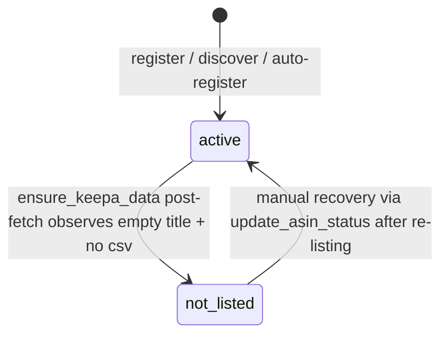

# Plan: Remove Intent Validation from product_asins.status (v6 migration)

## Summary

v5 刚把 status 收紧到 4 值（`unverified` / `verified` / `wrong_product` / `not_listed`）。v6 进一步简化为 **2 值**（`active` / `not_listed`），删除意图验证相关的全部代码：`validate_asins()` 函数、`validate_and_discover()` API 端点、`get_unverified_asins()` helper、对应测试类。query gate 收紧为只拒绝 `not_listed`。理由：单用户交互式 MVP 下，intent error 的源头是用户输入，用户能从 Keepa title 实时自查自修；保留意图验证是 over-engineering。详见 PRD `.claude/PRPs/prds/amz-scout-slim-refactor.prd.md` Decision 2026-04-17。

## User Story

As Jack（amz-scout 单用户 + 未来 Web 多用户），
I want ASIN registry 只负责记录身份 + 跟踪 Amazon 可用性，不再做 intent-level validation，
So that 代码路径更简洁、心智负担更低、查询路径更直接；将 intent 校验留给用户实时交互发现。

## Problem → Solution

**当前 (v5)**：4 值 enum，`validate_asins()` 做 brand/model in title 启发式 fuzzy 匹配，产生 `verified`/`wrong_product`；query gate 拒绝 `wrong_product` + `not_listed`。

**之后 (v6)**：2 值 enum（`active` 默认 + `not_listed`），删除 `validate_asins()` / `validate_and_discover()` / `get_unverified_asins()`；query gate 只挡 `not_listed`。`_try_mark_not_listed()` 和 `discover_asin()` 不动。

## Metadata

- **Complexity**: Medium
- **Source PRD**: `.claude/PRPs/prds/amz-scout-slim-refactor.prd.md` (Decision 2026-04-17)
- **PRD Phase**: standalone（紧随 v5 cleanup 后的迭代简化）
- **Estimated Files**: 8（db.py + api.py + test_db.py + test_api.py + test_core_flows.py + DEVELOPER.md + CLAUDE.md + plan report）

---

## UX Design

Internal change — no user-facing UI。但对 API/CLAUDE.md 契约有变化：

### Before
```
User: "验证 ASIN 的准确性"
Claude → validate_asins(marketplace="UK")
      → 跑 fuzzy 匹配 → {verified: N, wrong_product: N, not_listed: N, skipped: N}
```

### After
```
User: "验证 ASIN 的准确性"
Claude → "当前架构不再做 intent 验证。Amazon 可用性状态会在 ensure_keepa_data 时自动标记。
         如果怀疑 ASIN 错配，检查查询结果里的 Keepa title。"
       → 不调 validate_asins（已删除）
```

### Interaction Changes

| Touchpoint | Before | After | Notes |
|---|---|---|---|
| `validate_asins(marketplace=)` | 4 分类结果 envelope | **AttributeError**（函数已删）| 破坏性改动；需同步更新 CLAUDE.md decision tree |
| `validate_and_discover(...)` | 3-phase 工作流 | **AttributeError**（函数已删）| `discover_asin` 仍保留作为独立入口 |
| `query_trends("<wrong_asin>", marketplace="UK")` | `_resolve_asin` raise（gate 挡）| **放行**：返回 Keepa 真实数据（可能是错误产品）| 用户看 title 自查 |
| `query_trends("<not_listed_asin>", ...)` | raise ValueError | raise ValueError | 可用性门保留 |
| `ensure_keepa_data` post-fetch | 空 title+无 csv → not_listed | 同上 | 唯一自动写 status 路径 |
| `register_asin(..., status=?)` 默认 | `"unverified"` | `"active"` | 代码默认参数变化 |
| DB 初始化 | CHECK 4 值 | CHECK 2 值 | v5 → v6 migration 自动转换 |

---

## Mandatory Reading

| Priority | File | Lines | Why |
|---|---|---|---|
| P0 | `src/amz_scout/db.py` | 105 | `SCHEMA_VERSION` 常量 — 升 6 |
| P0 | `src/amz_scout/db.py` | 267-352 | `_migrate()` 的 v5 块 — v6 追加在其后 |
| P0 | `src/amz_scout/db.py` | 355-365 | `_SCHEMA_SQL` schema_migrations INSERT 序列 |
| P0 | `src/amz_scout/db.py` | 515-538 | `_SCHEMA_SQL` 的 product_asins CHECK |
| P0 | `src/amz_scout/db.py` | 1543-1545, 1569 | query gate 两处 — 收紧为 `status != 'not_listed'` |
| P0 | `src/amz_scout/db.py` | 1393-1410 | `register_asin` 默认 status 参数 |
| P0 | `src/amz_scout/db.py` | 594, 689 | `register_asin(...status="unverified")` 两处调用 |
| P0 | `src/amz_scout/db.py` | 1626-1642 | **删除** `get_unverified_asins()` |
| P0 | `src/amz_scout/api.py` | 230-320 | `_resolve_asin` 两处 status gate — 收紧 |
| P0 | `src/amz_scout/api.py` | 1298-1442 | **删除** `validate_asins()` 整个函数 |
| P0 | `src/amz_scout/api.py` | 1486-1556 | **删除** `validate_and_discover()` 整个函数 |
| P0 | `src/amz_scout/api.py` | 381-397 | `_try_mark_not_listed` — 保留不动 |
| P1 | `tests/test_db.py` | 46-69 | TestSchema — 版本断言 5→6 |
| P1 | `tests/test_db.py` | 363+（末尾）| TestStatusMigrationV5 — **整个类删除**，换成 TestStatusMigrationV6 |
| P1 | `tests/test_api.py` | 33 | import `validate_asins` — 删除 |
| P1 | `tests/test_api.py` | 843-926 | **删除** `TestValidateAsins` 整个类 |
| P1 | `tests/test_api.py` | 1039+（末尾）| `TestResolveAsinStatusGate` — 删除 `wrong_product` 分支测试 |
| P1 | `tests/test_core_flows.py` | 372-495 | **删除** `TestValidateAndDiscoverPhases` 整个类 |
| P1 | `docs/DEVELOPER.md` | ~102-130 | ASIN Status Semantics 章节 — 重写为 2 值 |
| P1 | `CLAUDE.md` | 27-28 | decision tree 删除"验证 ASIN" / "验证并发现" |
| P1 | `CLAUDE.md` | 49-52 | imports 删除 `validate_asins`, `validate_and_discover` |
| P1 | `CLAUDE.md` | 90 | Key Behaviors #10 — 重写 ASIN 验证条目 |
| P2 | `.claude/PRPs/prds/amz-scout-slim-refactor.prd.md` | 318-358 | Decision 2026-04-17 节 — 本 plan 的 source of truth |
| P2 | `.claude/PRPs/plans/completed/product-asins-status-cleanup.plan.md` | all | v5 plan 的模式参考（migration 写法、测试结构）|

## External Documentation

No external research needed — feature uses established internal patterns (sqlite3 + pytest)。

---

## Patterns to Mirror

### MIGRATION_V5_PATTERN（v5 的已落地模式，v6 继承）

```python
# SOURCE: src/amz_scout/db.py:268-352 (v5 migration block)
if current < 5:
    bad = conn.execute(
        "SELECT COUNT(*) AS c FROM product_asins WHERE status = 'unavailable'"
    ).fetchone()
    if bad and bad["c"] > 0:
        raise RuntimeError(...)

    conn.execute("ALTER TABLE product_asins RENAME TO product_asins_v4_old")
    conn.execute("""CREATE TABLE product_asins (...) CHECK(status IN (...))""")
    conn.execute("INSERT INTO product_asins (...) SELECT ... FROM product_asins_v4_old")
    conn.execute("DROP TABLE product_asins_v4_old")
    conn.execute("CREATE INDEX idx_pa_asin ON product_asins(asin)")
    conn.execute(
        "INSERT OR IGNORE INTO schema_migrations (version, description) "
        "VALUES (5, 'drop zombie unavailable status from product_asins.CHECK')"
    )
    logger.info("Migrated schema to version 5")
```

**关键**：v6 **不需要 sanity check**（任何 v5 合法值都能映射到 v6）；但需要**额外用 CASE mapping** 搬数据，否则 INSERT SELECT 会被新 CHECK 拒绝（老表里的 `verified`/`wrong_product`/`unverified` 不在 v6 CHECK 集合内）。

### CHECK_CONSTRAINT_REBUILD_WITH_MAPPING（v6 核心）

```python
conn.execute("ALTER TABLE product_asins RENAME TO product_asins_v5_old")
conn.execute("""
    CREATE TABLE product_asins (
        ...,
        status TEXT NOT NULL DEFAULT 'active'
            CHECK(status IN ('active', 'not_listed')),
        ...
    )
""")
conn.execute("""
    INSERT INTO product_asins
        (product_id, marketplace, asin, status, notes, last_checked, created_at, updated_at)
    SELECT
        product_id, marketplace, asin,
        CASE
            WHEN status = 'not_listed' THEN 'not_listed'
            ELSE 'active'
        END AS status,
        notes, last_checked, created_at, updated_at
    FROM product_asins_v5_old
""")
conn.execute("DROP TABLE product_asins_v5_old")
conn.execute("CREATE INDEX idx_pa_asin ON product_asins(asin)")
```

### STATUS_QUERY_FILTER_PATTERN（v5 已存，v6 收紧）

```python
# SOURCE: src/amz_scout/db.py:1543 (v5)
wheres.append(
    "pa.marketplace = ? AND pa.status NOT IN ('wrong_product', 'not_listed')"
)

# v6 target:
wheres.append("pa.marketplace = ? AND pa.status != 'not_listed'")
```

### RESOLVE_ASIN_STATUS_GATE（v5 已存，v6 收紧）

```python
# SOURCE: src/amz_scout/api.py:236-253 (v5)
if status_row and status_row["status"] in ("wrong_product", "not_listed"):
    raise ValueError(...)

# v6 target:
if status_row and status_row["status"] == "not_listed":
    raise ValueError(...)
```

### TEST_CLASS_STRUCTURE（现有模式，v6 复用）

```python
# SOURCE: tests/test_db.py:363-450 (v5 TestStatusMigrationV5)
class TestStatusMigrationV5:
    def test_v5_check_constraint_rejects_unavailable(self, conn): ...
    def test_v5_check_constraint_accepts_four_values(self, conn): ...
    def test_v5_idempotent(self, conn): ...
    def test_v5_preserves_existing_rows(self, tmp_path): ...
```

v6 镜像：

```python
class TestStatusMigrationV6:
    def test_v6_check_constraint_rejects_legacy_values(self, conn): ...
    def test_v6_check_constraint_accepts_two_values(self, conn): ...
    def test_v6_default_status_is_active(self, conn): ...
    def test_v6_idempotent(self, conn): ...
    def test_v6_migrates_legacy_statuses_to_active(self, tmp_path): ...
```

### LOGGER_PATTERN

```python
# SOURCE: src/amz_scout/db.py:352
logger.info("Migrated schema to version 5")
# v6:
logger.info("Migrated schema to version 6")
```

---

## Files to Change

| File | Action | Justification |
|---|---|---|
| `src/amz_scout/db.py` | UPDATE | (a) `SCHEMA_VERSION=6`; (b) v6 migration 块（rebuild with CASE mapping）; (c) `_SCHEMA_SQL` product_asins CHECK 收紧到 2 值 + DEFAULT `'active'` + schema_migrations v6 INSERT; (d) 两处查询过滤门 `NOT IN (...)` → `!= 'not_listed'`; (e) `register_asin` 默认参数 `"unverified"` → `"active"`; (f) 两处调用 `register_asin(..., status="unverified")` 改为 `"active"` 或移除; (g) **删除** `get_unverified_asins()` |
| `src/amz_scout/api.py` | UPDATE | (a) `_resolve_asin` 两处 status gate 收紧为只挡 `not_listed`; (b) **删除** `validate_asins()` 函数全体; (c) **删除** `validate_and_discover()` 函数全体; (d) 其他 `register_asin(..., status="unverified")` 或硬编码 `'unverified'` 调用更新为 `"active"` |
| `tests/test_db.py` | UPDATE | (a) schema version 断言 5→6; (b) **删除** `TestStatusMigrationV5` 整类（其条件被 v6 覆盖）; (c) 新增 `TestStatusMigrationV6`（5 tests）|
| `tests/test_api.py` | UPDATE | (a) imports 删除 `validate_asins`; (b) **删除** `TestValidateAsins` 整类; (c) `TestResolveAsinStatusGate` 删除 `wrong_product` 相关测试，保留 `not_listed` 分支 |
| `tests/test_core_flows.py` | UPDATE | **删除** `TestValidateAndDiscoverPhases` 整类（函数已删）|
| `docs/DEVELOPER.md` | UPDATE | ASIN Status Semantics 章节重写：2 值表 + 简化状态图 + 设计原则（intent vs availability） |
| `CLAUDE.md` | UPDATE | decision tree 删除"验证 ASIN"/"验证并发现"条目；imports 删除 `validate_asins`, `validate_and_discover`；Key Behaviors #10 改为"ASIN 下架检测：由 `ensure_keepa_data` post-fetch 自动标记，无需手动验证" |
| `.claude/PRPs/reports/remove-intent-validation-report.md` | CREATE | 实施报告（`/prp-implement` Phase 5 产出）|

## NOT Building

- 不引入 `is_listed` boolean 替代 enum — 保留 `status` TEXT 列为未来 Phase 3 的"per-user subscriptions"或"monitoring toggle"留扩展点
- 不改 `_try_mark_not_listed()` 的检测逻辑
- 不改 `discover_asin()` / `batch_discover()`
- 不加 EAN/UPC-based 意图验证（这是 PRD 里备注的"如果需要恢复 intent 验证应走的方向"，但本 plan 不实施）
- 不做 YAML 批量导入的 sanity check（保留为 Phase 3 backlog）
- 不修改 `update_asin_status()`（单入口写入契约不变，只是现在可写的值更少）
- 不动 `_bind_asin_to_product` 的 EAN 跨市场绑定逻辑
- 不引入 feature flag 或 dual-write — v6 是硬切换

---

## Step-by-Step Tasks

### Task 1: 升 SCHEMA_VERSION 到 6

- **ACTION**: 修改 `src/amz_scout/db.py:105` 把 `SCHEMA_VERSION = 5` 改为 `SCHEMA_VERSION = 6`
- **IMPLEMENT**: 单行修改
- **MIRROR**: N/A（常量更新）
- **IMPORTS**: 无
- **GOTCHA**: 修改后所有现有 DB 文件下次 boot 都会触发 v6 migration — 必须先完成 Task 2 才能跑测试
- **VALIDATE**: `grep "SCHEMA_VERSION" src/amz_scout/db.py` 显示 `= 6`

### Task 2: 在 `_migrate()` 加 v6 块（rebuild + CASE mapping）

- **ACTION**: 在 `src/amz_scout/db.py` v5 块（以 `logger.info("Migrated schema to version 5")` 结尾）之后，`except Exception:` 之前，追加 v6 块
- **IMPLEMENT**:
```python
if current < 6:
    # v6: remove intent validation — collapse status to 2 values.
    # Map legacy statuses:
    #   'unverified', 'verified', 'wrong_product' -> 'active'
    #   'not_listed' -> 'not_listed' (preserved)
    # SQLite cannot ALTER CHECK — rebuild with CASE mapping in INSERT SELECT.

    conn.execute(
        "ALTER TABLE product_asins RENAME TO product_asins_v5_old"
    )
    conn.execute("""
        CREATE TABLE product_asins (
            product_id      INTEGER NOT NULL
                REFERENCES products(id) ON DELETE CASCADE,
            marketplace     TEXT NOT NULL,
            asin            TEXT NOT NULL,
            -- Status semantics (since v6):
            --   active      : default; queryable; not observed as delisted
            --   not_listed  : Keepa returned empty title + no csv data
            --                 (ASIN dead/removed on Amazon)
            -- No intent validation — trust user input + Keepa identity.
            -- See docs/DEVELOPER.md "ASIN Status Semantics".
            status          TEXT NOT NULL DEFAULT 'active'
                CHECK(status IN ('active', 'not_listed')),
            notes           TEXT NOT NULL DEFAULT '',
            last_checked    TEXT,
            created_at      TEXT NOT NULL
                DEFAULT (strftime('%Y-%m-%dT%H:%M:%SZ', 'now')),
            updated_at      TEXT NOT NULL
                DEFAULT (strftime('%Y-%m-%dT%H:%M:%SZ', 'now')),
            PRIMARY KEY (product_id, marketplace)
        )
    """)
    conn.execute("""
        INSERT INTO product_asins
            (product_id, marketplace, asin, status, notes,
             last_checked, created_at, updated_at)
        SELECT
            product_id, marketplace, asin,
            CASE
                WHEN status = 'not_listed' THEN 'not_listed'
                ELSE 'active'
            END AS status,
            notes, last_checked, created_at, updated_at
        FROM product_asins_v5_old
    """)
    conn.execute("DROP TABLE product_asins_v5_old")
    conn.execute(
        "CREATE INDEX idx_pa_asin ON product_asins(asin)"
    )

    conn.execute(
        "INSERT OR IGNORE INTO schema_migrations "
        "(version, description) VALUES "
        "(6, 'remove intent validation: status -> active/not_listed')"
    )
    logger.info("Migrated schema to version 6")
```
- **MIRROR**: `MIGRATION_V5_PATTERN` + `CHECK_CONSTRAINT_REBUILD_WITH_MAPPING`
- **IMPORTS**: 无新增
- **GOTCHA**: (1) **不用 sanity check** — 任何 v5 合法值都能映射到 v6；(2) **不能先 UPDATE 后 rebuild** — 老 CHECK 不允许 `active`；必须用 `INSERT ... SELECT CASE` 在搬数据的同时做值转换；(3) `_migrate` 已在 `with conn:` 包裹事务；(4) 索引 `idx_pa_asin` 必须 rebuild（RENAME 跟旧表走了）
- **VALIDATE**: `pytest tests/test_db.py::TestStatusMigrationV6 -v`（Task 10 会写）

### Task 3: 同步更新 `_SCHEMA_SQL`（fresh DB 路径）

- **ACTION**: 修改 `src/amz_scout/db.py` 的 `_SCHEMA_SQL`：(a) 追加 v6 schema_migrations INSERT; (b) product_asins CHECK 改 2 值 + DEFAULT `'active'`
- **IMPLEMENT**:

在 `INSERT INTO schema_migrations ... VALUES (5, ...)` 之后追加：
```sql
INSERT INTO schema_migrations (version, description)
    VALUES (6, 'remove intent validation: status -> active/not_listed');
```

把 `CREATE TABLE product_asins (...)` 块的 status 定义改为：
```sql
CREATE TABLE product_asins (
    product_id      INTEGER NOT NULL REFERENCES products(id) ON DELETE CASCADE,
    marketplace     TEXT NOT NULL,
    asin            TEXT NOT NULL,
    -- Status semantics (since v6):
    --   active      : default; queryable; not observed as delisted
    --   not_listed  : Keepa returned empty title + no csv (ASIN dead/removed)
    -- No intent validation — trust user input + Keepa identity.
    -- See docs/DEVELOPER.md "ASIN Status Semantics".
    status          TEXT NOT NULL DEFAULT 'active'
                    CHECK(status IN ('active', 'not_listed')),
    notes           TEXT NOT NULL DEFAULT '',
    last_checked    TEXT,
    created_at      TEXT NOT NULL DEFAULT (strftime('%Y-%m-%dT%H:%M:%SZ', 'now')),
    updated_at      TEXT NOT NULL DEFAULT (strftime('%Y-%m-%dT%H:%M:%SZ', 'now')),
    PRIMARY KEY (product_id, marketplace)
);
```

- **MIRROR**: `_SCHEMA_SQL` 现有 SQL 缩进/注释风格
- **IMPORTS**: 无
- **GOTCHA**: **不要修改 v3 init block（db.py:218-238）和 v5 migration block CHECK** — 它们是历史 migration，必须维持 5值/4值原状。只修 `_SCHEMA_SQL`
- **VALIDATE**: fresh `:memory:` + `init_schema` 后 `PRAGMA table_info(product_asins)` 包含新 CHECK；`INSERT ... status='verified'` 应报 IntegrityError

### Task 4: 收紧 SQL 查询过滤门（db.py `load_products_from_db`）

- **ACTION**: 修改 `src/amz_scout/db.py:1543` 和 `:1569` 两处过滤
- **IMPLEMENT**:
```python
# db.py:1543
wheres.append("pa.marketplace = ? AND pa.status != 'not_listed'")

# db.py:1569
f"AND status != 'not_listed'",
```
- **MIRROR**: `STATUS_QUERY_FILTER_PATTERN`
- **IMPORTS**: 无
- **GOTCHA**: 用 `status != 'not_listed'`（不用 `status = 'active'`），防御性地兼容 v6 之后若引入新值
- **VALIDATE**: `pytest tests/test_api.py::TestResolveAsinStatusGate::test_query_filter_excludes_not_listed_in_load_products -v`

### Task 5: 收紧 `_resolve_asin` 两处 status gate（api.py）

- **ACTION**: 修改 `src/amz_scout/api.py` 两处（DB registry hit 路径 + ASIN pass-through 路径）
- **IMPLEMENT**:

**(a) DB registry hit 路径**（约 api.py:245-253）：
```python
if status_row and status_row["status"] == "not_listed":
    raise ValueError(
        f"ASIN {row['asin']} for {row['marketplace']} is marked "
        "'not_listed' (observed delisted on Amazon). "
        "Run discover_asin() to find a valid ASIN, or "
        "update_asin_status() if this was misclassified."
    )
```

**(b) ASIN pass-through 路径**（约 api.py:275-286）：
```python
if status_row and status_row["status"] == "not_listed":
    raise ValueError(
        f"ASIN {candidate} for {marketplace} is marked "
        "'not_listed' (observed delisted on Amazon). "
        "Run discover_asin() for a valid ASIN, or "
        "update_asin_status() if this was misclassified."
    )
```

- **MIRROR**: `RESOLVE_ASIN_STATUS_GATE`
- **IMPORTS**: 无
- **GOTCHA**: 错误信息不再提 `wrong_product`；保持 actionable（discover / update）
- **VALIDATE**: `pytest tests/test_api.py::TestResolveAsinStatusGate -v`

### Task 6: 更新 `register_asin` 默认参数 + 所有 `status="unverified"` 调用点

- **ACTION**:
  - 修改 `src/amz_scout/db.py:1398` 默认参数 `status: str = "unverified"` → `= "active"`
  - 修改 `db.py:594`（`_bind_asin_to_product` 内）：`register_asin(conn, product_id, site, asin, status="unverified")` → 移除 status 参数（用新默认 `"active"`）
  - 修改 `db.py:689`（`_try_register_product` 内）：同上
  - `api.py` 内 grep `"unverified"` 字面量 — 逐处检查：若是 SQL INSERT 里的硬编码（如 `api.py:1204` 的 `(pid, mp, asin, "unverified", "")`）改为 `"active"`；若是 Python 参数调用则移除
- **IMPLEMENT**: 每处按上述替换
- **MIRROR**: 保持单入口 `register_asin` 的风格
- **IMPORTS**: 无
- **GOTCHA**: (1) `api.py:1204` 是 `INSERT ... VALUES (?, ?, ?, 'unverified', '')` 风格的硬编码 SQL — 改成 `'active'`；(2) `api.py:1340` 的 `WHERE pa.status = 'unverified'` 是 `validate_asins` 内部 SQL — 整个函数会在 Task 8 删除，无需单独改
- **VALIDATE**: `grep -n "'unverified'\|\"unverified\"" src/amz_scout/` 除测试和 migration 历史外返回 0 行

### Task 7: 删除 `get_unverified_asins()`（db.py）

- **ACTION**: 删除 `src/amz_scout/db.py:1626-1642` 整个函数
- **IMPLEMENT**: 直接删除函数 + 前后空行整理
- **MIRROR**: N/A（删除）
- **IMPORTS**: 无
- **GOTCHA**: 确认无其他模块 import 此函数（grep `get_unverified_asins` → 只在 db.py 内，但验证时 api.py 的 validate_asins 内部 SQL 等价使用了 WHERE pa.status = 'unverified' — 函数本身只在 validate_asins 路径用过）
- **VALIDATE**: `grep -n "get_unverified_asins" src/ tests/` 全项目零命中

### Task 8: 删除 `validate_asins()` + `validate_and_discover()`（api.py）

- **ACTION**:
  - 删除 `src/amz_scout/api.py:1298-1442`（`validate_asins` 整个函数，含 docstring + try/except）
  - 删除 `src/amz_scout/api.py:1486-1556`（`validate_and_discover` 整个函数）
- **IMPLEMENT**: 两段函数整块删除
- **MIRROR**: N/A（删除）
- **IMPORTS**:
  - `from amz_scout.db import update_asin_status`（在 `validate_asins` 内 local import）随函数删除自动清理
  - 文件顶部 imports 无 `update_asin_status` — 无需动
- **GOTCHA**: (1) 删除前确认 `_try_mark_not_listed`（api.py:381）不依赖 `validate_asins`；(2) 保留 `_run_discover_batch`（api.py:1445）— 它被 `batch_discover` 使用，与 `validate_and_discover` 解耦
- **VALIDATE**: `grep -n "def validate_asins\|def validate_and_discover" src/amz_scout/` 零命中；`python -c "from amz_scout.api import query_trends"` 不报错

### Task 9: 更新现有测试 — schema version 断言 + 删除 TestStatusMigrationV5

- **ACTION**:
  - `tests/test_db.py:65,69` 的 `== 5` 改为 `== 6`
  - `tests/test_db.py:363-450`（`TestStatusMigrationV5` 整类）删除 — 理由：v5 的 CHECK 4 值 / DEFAULT unverified / 接受 4 值等测试条件都被 v6 覆盖；该类用 :memory: fixture 跑的是"v6 的一部分"而非纯 v5，已无独立语义
- **IMPLEMENT**:
```python
# test_db.py:65
assert row[0] == 6  # v1 + v2 + v3 + v4 + v5 + v6
# test_db.py:69
assert row[0] == 6
```
删除 `TestStatusMigrationV5` 全类。
- **MIRROR**: 现有 assert 风格
- **IMPORTS**: 无
- **GOTCHA**: 漏改版本断言会 CI 红
- **VALIDATE**: `pytest tests/test_db.py::TestSchema -v` 全绿

### Task 10: 新增 TestStatusMigrationV6（5 tests）

- **ACTION**: 在 `tests/test_db.py` 末尾新增 `TestStatusMigrationV6` 类
- **IMPLEMENT**:
```python
# ─── Schema v6 migration tests ───────────────────────────────────────


class TestStatusMigrationV6:
    """Verify schema v6 migration: collapse status to 2 values (active/not_listed)."""

    def test_v6_check_constraint_rejects_legacy_values(self, conn):
        from amz_scout.db import register_product

        pid, _ = register_product(conn, "Router", "Test", "M1")
        for i, bad in enumerate(("unverified", "verified", "wrong_product")):
            with pytest.raises(sqlite3.IntegrityError):
                conn.execute(
                    "INSERT INTO product_asins "
                    "(product_id, marketplace, asin, status) "
                    "VALUES (?, ?, ?, ?)",
                    (pid, f"M{i:02d}", f"B0LEG{i:05d}", bad),
                )

    def test_v6_check_constraint_accepts_two_values(self, conn):
        from amz_scout.db import register_product

        pid, _ = register_product(conn, "Router", "Test", "M2")
        for i, status in enumerate(["active", "not_listed"]):
            conn.execute(
                "INSERT INTO product_asins "
                "(product_id, marketplace, asin, status) "
                "VALUES (?, ?, ?, ?)",
                (pid, f"MK{i}", f"B0CC{i:06d}", status),
            )

    def test_v6_default_status_is_active(self, conn):
        from amz_scout.db import register_asin, register_product

        pid, _ = register_product(conn, "Router", "Test", "M3")
        register_asin(conn, pid, "UK", "B0DDDD0001")
        row = conn.execute(
            "SELECT status FROM product_asins WHERE asin = 'B0DDDD0001'"
        ).fetchone()
        assert row["status"] == "active"

    def test_v6_idempotent(self, conn):
        init_schema(conn)  # second call
        row = conn.execute(
            "SELECT COUNT(*) AS c FROM schema_migrations WHERE version = 6"
        ).fetchone()
        assert row["c"] == 1

    def test_v6_migrates_legacy_statuses_to_active(self, tmp_path):
        """v5 -> v6 upgrade: {unverified, verified, wrong_product} -> active;
        not_listed preserved."""
        import amz_scout.db as db_mod
        from amz_scout.db import register_product

        db_path = tmp_path / "v5tov6.db"

        original_version = db_mod.SCHEMA_VERSION
        try:
            db_mod.SCHEMA_VERSION = 5
            db_mod._schema_initialized.discard(str(db_path))
            c1 = sqlite3.connect(str(db_path))
            c1.row_factory = sqlite3.Row
            init_schema(c1)
            pid, _ = register_product(c1, "R", "B", "M")
            for mp, asin, status in [
                ("UK", "B0UNVER0001", "unverified"),
                ("DE", "B0VERIF0001", "verified"),
                ("FR", "B0WRONG0001", "wrong_product"),
                ("JP", "B0NOTLI0001", "not_listed"),
            ]:
                c1.execute(
                    "INSERT INTO product_asins "
                    "(product_id, marketplace, asin, status) "
                    "VALUES (?, ?, ?, ?)",
                    (pid, mp, asin, status),
                )
            c1.commit()
            c1.close()
        finally:
            db_mod.SCHEMA_VERSION = original_version
            db_mod._schema_initialized.discard(str(db_path))

        c2 = sqlite3.connect(str(db_path))
        c2.row_factory = sqlite3.Row
        init_schema(c2)

        rows = {
            r["marketplace"]: r["status"]
            for r in c2.execute(
                "SELECT marketplace, status FROM product_asins"
            ).fetchall()
        }
        assert rows["UK"] == "active"          # was unverified
        assert rows["DE"] == "active"          # was verified
        assert rows["FR"] == "active"          # was wrong_product
        assert rows["JP"] == "not_listed"      # preserved
        ver = c2.execute(
            "SELECT MAX(version) AS v FROM schema_migrations"
        ).fetchone()
        assert ver["v"] == 6
        c2.close()
```
- **MIRROR**: `TEST_CLASS_STRUCTURE`（v5 的模式）+ `TEST_FIXTURE_PATTERN`（`:memory:` + `tmp_path`）
- **IMPORTS**: `import sqlite3, pytest` 已存在
- **GOTCHA**: (1) `_schema_initialized` cache 必须在 monkey-patch 前后 `discard`；(2) 用 `tmp_path` 文件路径，不用 `:memory:`（后者 cache 不跳过）；(3) ASIN 必须 10 字符合法
- **VALIDATE**: `pytest tests/test_db.py::TestStatusMigrationV6 -v` 5 个 test 全绿

### Task 11: 更新 tests/test_api.py — 删除 TestValidateAsins + 简化 TestResolveAsinStatusGate

- **ACTION**:
  - 从 imports 删除 `validate_asins`（tests/test_api.py:33）
  - 删除 `TestValidateAsins` 整类（tests/test_api.py:843-926）
  - 从 `TestResolveAsinStatusGate`（末尾类）删除 `wrong_product` 分支测试：
    - 方法 `test_raises_on_wrong_product_asin_pass_through`
    - `_setup_db` 中注册 `B0WRONG001` 的那行
  - `register_asin(..., status="verified")` 调用改为 `status="active"`
  - `test_passes_for_verified_asin` 改名为 `test_passes_for_active_asin`
- **IMPLEMENT**:

Imports 修改（tests/test_api.py:33）：
```python
from amz_scout.api import (
    ...
    # validate_asins,   <- 删除
    ...
)
```

`TestResolveAsinStatusGate._setup_db` 修改：
```python
def _setup_db(self, tmp_path):
    db_path = tmp_path / "status_gate.db"
    c = sqlite3.connect(str(db_path))
    c.row_factory = sqlite3.Row
    init_schema(c)
    pid, _ = register_product(c, "Router", "TestBrand", "TestModel")
    register_asin(c, pid, "UK", "B0DEADXXX1", status="not_listed", notes="")
    # Removed: wrong_product row (no longer a valid status in v6)
    register_asin(c, pid, "FR", "B0GOOD0001", status="active", notes="")
    c.close()
    return db_path
```

删除 `test_raises_on_wrong_product_asin_pass_through` 整方法。

`test_passes_for_verified_asin` 改名并调整：
```python
def test_passes_for_active_asin(self, tmp_path):
    ...
    # status="active" instead of "verified"
```

删除 `TestValidateAsins` 整类（843 行起）。

- **MIRROR**: 现有测试风格
- **IMPORTS**: 保留 `_resolve_asin, register_asin, register_product, init_schema` 等
- **GOTCHA**: (1) `pytest.raises(ValueError, match="wrong_product")` 已无意义；(2) `TestEnsureKeepaDataPostValidation`（928 行）**保留** — 它测 `_try_mark_not_listed`，与 `validate_asins` 无关
- **VALIDATE**: `pytest tests/test_api.py -v` 全绿；`grep -n "validate_asins\|wrong_product" tests/test_api.py` 零命中（除注释外）

### Task 12: 更新 tests/test_core_flows.py — 删除 TestValidateAndDiscoverPhases

- **ACTION**: 删除 `tests/test_core_flows.py:372-495` 的 `TestValidateAndDiscoverPhases` 整类（及其上方 `# --- I8: validate_and_discover phase transitions ---` 注释）
- **IMPLEMENT**: 直接删除该 class + 相关注释
- **MIRROR**: N/A（删除）
- **IMPORTS**:
  - 文件顶部若有 `from amz_scout.api import validate_and_discover` — 删除
  - `from unittest.mock import patch` — 若其他测试还用则保留
- **GOTCHA**: 文件顶的 I-编号注释（"I8: validate_and_discover phase transitions"）也要同步删除
- **VALIDATE**: `pytest tests/test_core_flows.py -v` 全绿；`grep -n "validate_and_discover\|validate_asins" tests/test_core_flows.py` 零命中

### Task 13: 重写 docs/DEVELOPER.md 的 ASIN Status Semantics 章节

- **ACTION**: 把 v5 的 4 值章节整个替换为 v6 的 2 值版本
- **IMPLEMENT**:
```markdown
## ASIN Status Semantics

`product_asins.status` (since schema v6) is a 2-value enum. It tracks **Amazon availability**, not user intent validation.

### Values

| Value | Meaning | Typical Trigger |
|-------|---------|-----------------|
| `active` | Default; queryable. Registered and not observed as delisted. | Default on insert; `add_product`, `discover_asin`, `_auto_register_from_keepa`, `register_asin` |
| `not_listed` | Observed empty-title response from Keepa (ASIN dead/removed on Amazon) | `_try_mark_not_listed()` during `ensure_keepa_data` post-fetch validation |

### Design Principle — Intent vs Availability

- **Intent errors** (user supplies ambiguous / wrong ASIN / model) → user's own input is the source; interactive users can spot the mismatch from the returned Keepa title and correct their query. No automated pre-validation needed.
- **Availability errors** (Amazon delisted the product) → external system is the source; user cannot tell empty-data from market-unavailable-data without a system signal. `not_listed` serves this purpose.

### Query Gate

`_resolve_asin` and `load_products_from_db` reject only `not_listed` — `active` rows pass through. This prevents the silent-failure bug where users would see "no data" when the real cause was a dead ASIN.

### State Diagram



### Single Write Entry Point

All status mutations should go through `update_asin_status()` (db.py). Direct SQL updates bypass `last_checked` / `updated_at` bookkeeping.

### What's NOT in this column (deferred to Phase 3)

- **Monitoring on/off per user** — will live in a future `user_product_subscriptions` table
- **Validation freshness (stale)** — derive from `last_checked` timestamp at query time
- **Intent validation** — removed in v6; rely on interactive user review of Keepa titles. If future scale requires automation, use EAN/UPC matching (see `_find_product_by_ean`) rather than title fuzzy matching
```
- **MIRROR**: 现有 DEVELOPER.md 章节风格
- **IMPORTS**: N/A
- **GOTCHA**: mermaid 图简化 — 只有 2 节点；别留 v5 的复杂跳转线
- **VALIDATE**: markdown 渲染 mermaid 图正确显示

### Task 14: 更新 CLAUDE.md decision tree + imports + Key Behaviors

- **ACTION**: 三处修改
- **IMPLEMENT**:

**(a)** 删除 `CLAUDE.md:27-28` 的两行：
```
  │   ├─ "验证 ASIN"              → validate_asins(marketplace=)
  │   ├─ "验证并发现"              → validate_and_discover(marketplace=)
```

**(b)** 修改 `CLAUDE.md:49-52` imports 块，去掉 `validate_asins` 和 `validate_and_discover`：
```python
from amz_scout.api import (
    query_latest, query_trends, query_compare, query_ranking,
    query_availability, query_sellers, query_deals,
    ensure_keepa_data, check_freshness, keepa_budget, sync_registry,
    list_products, add_product, remove_product_by_model, update_product_asin,
    register_market_asins, get_pending_markets, import_yaml, discover_asin,
    batch_discover, resolve_product,
)
```

**(c)** 重写 `CLAUDE.md:90` Key Behaviors #10：
```
10. **ASIN 下架检测**: `ensure_keepa_data()` post-fetch 自动标记 `not_listed`（空 title + 无 csv）。无需显式 validate。Intent 错配（ASIN 对不上用户想要的产品）由用户看 Keepa title 自查。
```

- **MIRROR**: CLAUDE.md 现有 markdown 风格
- **IMPORTS**: N/A
- **GOTCHA**: 确保 decision tree 缩进与旁边条目对齐；imports 括号/逗号无多余
- **VALIDATE**: `grep -n "validate_asins\|validate_and_discover" CLAUDE.md` 零命中

---

## Testing Strategy

### Unit Tests

| Test | Input | Expected Output | Edge Case? |
|---|---|---|---|
| `test_v6_check_constraint_rejects_legacy_values` | INSERT `verified`/`wrong_product`/`unverified` | `IntegrityError` × 3 | Yes |
| `test_v6_check_constraint_accepts_two_values` | INSERT `active` / `not_listed` | Both succeed | — |
| `test_v6_default_status_is_active` | `register_asin(..., )` 无显式 status | `status == "active"` | — |
| `test_v6_idempotent` | `init_schema(conn)` 跑 2 次 | schema_migrations v6 行 count == 1 | Yes |
| `test_v6_migrates_legacy_statuses_to_active` | v5 DB 4 种 status → v6 升级 | 3 种映射到 `active`；`not_listed` 保持 | Yes |
| `test_init_schema_idempotent`（更新）| init_schema × 2 | `count == 6` | — |
| `test_schema_version`（更新）| MAX(version) | `6` | — |
| `TestResolveAsinStatusGate::test_raises_on_not_listed_asin_pass_through` | `_resolve_asin("B0DEAD...", "UK")` status=not_listed | `ValueError("not_listed")` | Yes |
| `TestResolveAsinStatusGate::test_passes_for_active_asin`（改名）| `_resolve_asin("B0GOOD...", "FR")` status=active | 返回正常 5-tuple | — |
| `TestResolveAsinStatusGate::test_query_filter_excludes_not_listed_in_load_products` | `load_products_from_db("UK")` UK 只有 not_listed | `[]` | Yes |
| `TestResolveAsinStatusGate::test_query_envelope_failure_for_not_listed` | `query_trends("B0DEAD...", "UK")` | `{"ok": False, "error": "not_listed"}` | Yes |

### Edge Cases Checklist

- [x] v5 → v6 upgrade 保留所有 not_listed 行
- [x] v5 → v6 upgrade 把 3 种 legacy status 映射到 `active`
- [x] v6 idempotent（rerun safe）
- [x] `INSERT OR IGNORE` 防止 schema_migrations 重复插入
- [x] CHECK 在 fresh DB 和 migrated DB 都强制 2 值
- [x] `_resolve_asin` 在 conn=None 时不调 status 检查（向后兼容）
- [x] `register_asin` 默认 status 为 `"active"`
- [x] 旧代码若显式传 `status="verified"` / `"wrong_product"` / `"unverified"` 会被 CHECK 拒绝并 raise `IntegrityError`（这是预期行为 — 留了显式错误信号，方便外部代码迁移）
- [x] `discover_asin` 和 `_try_mark_not_listed` 在 v6 下继续工作

### 测试删除检查

- [x] `tests/test_api.py::TestValidateAsins` 整类删除（`validate_asins` 不存在）
- [x] `tests/test_core_flows.py::TestValidateAndDiscoverPhases` 整类删除（`validate_and_discover` 不存在）
- [x] `tests/test_db.py::TestStatusMigrationV5` 整类删除（v6 覆盖）
- [x] imports 中的 `validate_asins` 行删除

---

## Validation Commands

### Static Analysis
```bash
ruff check src/ tests/
```
EXPECT: No new violations on modified files. 删除的 imports 或孤立使用会被 ruff 指出，用 `ruff check --fix` 或手工清理。

### Unit Tests — affected modules
```bash
pytest tests/test_db.py tests/test_api.py tests/test_core_flows.py -v
```
EXPECT: All pass. `TestStatusMigrationV6` 5 个新 test 全绿；`TestResolveAsinStatusGate` 4 个（原 5 个 -1 wrong_product）全绿。

### Full Test Suite
```bash
pytest tests/ -x --ignore=tests/test_webapp_smoke.py
```
EXPECT: 约 253-258 passed（v5 基线 267 passed；扣除 TestValidateAsins ~6 tests、TestValidateAndDiscoverPhases ~4 tests、TestStatusMigrationV5 4 tests；新增 TestStatusMigrationV6 5 tests；净减约 9 tests）。

### Database Validation (manual)
```bash
sqlite3 output/amz_scout.db "SELECT MAX(version) FROM schema_migrations;"
# EXPECT: 6

sqlite3 output/amz_scout.db "PRAGMA table_info(product_asins);"
# EXPECT: status CHECK contains only 'active','not_listed'

sqlite3 output/amz_scout.db "SELECT DISTINCT status, COUNT(*) FROM product_asins GROUP BY status;"
# EXPECT: only 'active' and/or 'not_listed' appear
```

### Manual Validation
- [ ] `amz-scout --version` 不报 schema 错误
- [ ] `python -c "from amz_scout.api import query_trends; r=query_trends(product='B0F2MR53D6', marketplace='UK', auto_fetch=False); print(r['ok'])"` 正常返回（若 DB 有该 ASIN）
- [ ] `python -c "from amz_scout.api import validate_asins"` 抛 ImportError ✓（证明删除成功）
- [ ] `python -c "from amz_scout.api import validate_and_discover"` 抛 ImportError ✓
- [ ] DEVELOPER.md 渲染：mermaid 2 节点状态图正确显示
- [ ] CLAUDE.md decision tree 缩进整齐，无孤立 `│` 符号

---

## Rollback Path

如果 v6 migration 出错或需要紧急回滚：

```sql
-- 备份
CREATE TABLE product_asins_v6_backup AS SELECT * FROM product_asins;

-- 代码层回滚：git revert <commit-sha> + SCHEMA_VERSION=5
-- 然后手工恢复 CHECK：
ALTER TABLE product_asins RENAME TO product_asins_v6_old;
CREATE TABLE product_asins (
    product_id      INTEGER NOT NULL REFERENCES products(id) ON DELETE CASCADE,
    marketplace     TEXT NOT NULL,
    asin            TEXT NOT NULL,
    status          TEXT NOT NULL DEFAULT 'unverified'
                    CHECK(status IN ('unverified','verified','wrong_product','not_listed')),
    notes           TEXT NOT NULL DEFAULT '',
    last_checked    TEXT,
    created_at      TEXT NOT NULL DEFAULT (strftime('%Y-%m-%dT%H:%M:%SZ', 'now')),
    updated_at      TEXT NOT NULL DEFAULT (strftime('%Y-%m-%dT%H:%M:%SZ', 'now')),
    PRIMARY KEY (product_id, marketplace)
);
-- 把 'active' 映射回 'unverified'（最安全 — 原始 intent 信息已丢失）
INSERT INTO product_asins SELECT
    product_id, marketplace, asin,
    CASE WHEN status = 'not_listed' THEN 'not_listed' ELSE 'unverified' END,
    notes, last_checked, created_at, updated_at
FROM product_asins_v6_old;
DROP TABLE product_asins_v6_old;
CREATE INDEX idx_pa_asin ON product_asins(asin);

DELETE FROM schema_migrations WHERE version = 6;
```

注意：回滚会**丢失 active ↔ verified/wrong_product/unverified 的原始区分** — v6 已把 3 种 intent 状态 collapsed 到 `active`，无法复原。如果需要重新做 intent 验证，重新跑 `validate_asins`（回滚后函数恢复）即可。

MVP 无外部消费者，回滚风险低。

---

## Acceptance Criteria

- [ ] All 14 tasks completed
- [ ] All validation commands pass
- [ ] 5 new tests written and passing (`TestStatusMigrationV6`)
- [ ] 2 existing tests updated (schema version asserts)
- [ ] 3 test classes deleted (`TestValidateAsins`, `TestValidateAndDiscoverPhases`, `TestStatusMigrationV5`)
- [ ] 2 API 函数删除（`validate_asins`, `validate_and_discover`）
- [ ] 1 DB helper 删除（`get_unverified_asins`）
- [ ] No new ruff violations
- [ ] `pytest tests/` 全绿（净减约 9 tests）
- [ ] `grep -rn "'unverified'\|'verified'\|'wrong_product'" src/` 仅在 v3/v4/v5 migration 历史块和新 v6 migration 的 CASE SELECT 出现
- [ ] DEVELOPER.md `ASIN Status Semantics` 章节重写为 2 值
- [ ] CLAUDE.md decision tree / imports / Key Behaviors 同步
- [ ] 本地 sqlite3 manual check 通过
- [ ] 实战验证窗口开启：后续 1-2 周交互式使用中记录 intent error 自修正情况

## Completion Checklist

- [ ] Migration 模式与 v2/v3/v4/v5 一致（`if current < 6:` + `with conn:` + `INSERT OR IGNORE`）
- [ ] CHECK rebuild 用 RENAME → CREATE → INSERT+CASE → DROP → 重建 idx 模式
- [ ] Error raise 用 `ValueError` 与现有 `_resolve_asin` 一致
- [ ] 错误信息仍含 actionable suggestion（`discover_asin` / `update_asin_status`）
- [ ] 测试用 `:memory:` SQLite + `tmp_path` 文件 + class-style + AAA 模式
- [ ] Logger 用 `logger.info("Migrated schema to version 6")` 与 v5 对齐
- [ ] inline schema 注释 + DEVELOPER.md 外部文档一致
- [ ] 不引入新依赖
- [ ] 不破坏 `_try_mark_not_listed()` / `discover_asin()` 现有路径
- [ ] Self-contained: 不需要在实施时再搜代码

## Risks

| Risk | Likelihood | Impact | Mitigation |
|---|---|---|---|
| `_schema_initialized` cache 让 migration 跳过 | M | H | Task 10 monkey-patch test 显式 `discard` 缓存键（继承 v5 模式）|
| 删除 `validate_asins` 破坏外部调用者（webapp、CLI）| L | M | grep 全项目验证；webapp/tools.py 不直接 import 这两个函数（需实施时再 grep 复核）|
| v5 DB 升级时非 `not_listed` 的 intent 数据丢失 | H | L | 这是**预期行为** — intent validation 已决定不保留；rollback path 文档化不可恢复性 |
| 实战发现 intent 错误比预期多，需恢复 validate | M | M | Rollback path 已文档化；若恢复应走 EAN/UPC 路线而非复活 `validate_asins` |
| CLAUDE.md / webapp PRD 引用未同步 | M | L | Task 14 清理 CLAUDE.md；webapp PRD (`internal-amz-scout-web.prd.md`) 中 `validate_asins`/`validate_and_discover` 出现在 Phase 4 scope 表 — 手动检查并追加一条 update 说明"已删除"|
| Test fixtures 里依赖 `status="verified"` 的其他测试 | M | L | grep 确认只有 `TestResolveAsinStatusGate` 用，已纳入 Task 11 |

## Notes

- **决策源头**：`.claude/PRPs/prds/amz-scout-slim-refactor.prd.md` Decision 2026-04-17 节；核心论点是"intent error 源头是用户，交互式场景用户能自查自修；availability error 源头是外部，必须系统标记"。
- **实战验证方法**：v6 落地后保持 1-2 周观察窗口。如果发生"用户拿到错产品但没发现"或"批量导入后无法察觉错配"的情况 ≥2 次，重新评估。恢复路径是 EAN/UPC 验证（参考 `_find_product_by_ean`），不是复活 title 启发式。
- **与 Phase 3 的关系**：本 plan 的简化不干扰 multi-user subscriptions 设计 — 多用户信任边界应在 `user_product_subscriptions` 层，与 `product_asins.status` 正交。
- **预估工作量**：~1.5 hour 实施 + 0.5 hour review，单一 PR。

---

*Generated: 2026-04-17*
*Source: `.claude/PRPs/prds/amz-scout-slim-refactor.prd.md` Decision 2026-04-17 + conversation audit*
*Follows v5 plan `.claude/PRPs/plans/completed/product-asins-status-cleanup.plan.md` as direct successor*
