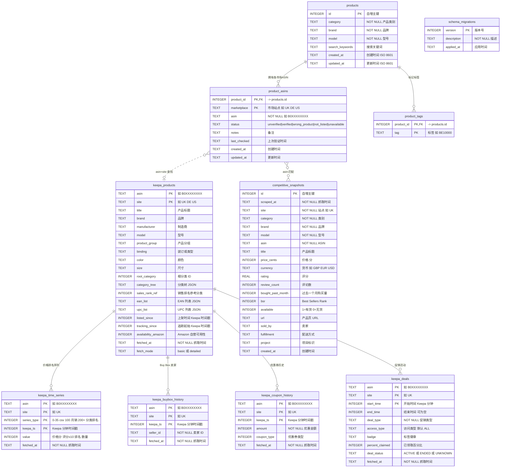

# amz-scout 数据库 ER 图

> Schema 版本: 4 | SQLite (WAL 模式) | 10 张表

## ER 图

## 表分组

| 层级 | 表 | 数据来源 |
|------|-----|---------|
| **产品注册表** | `products`, `product_asins`, `product_tags` | 手动添加 / YAML 导入 / Keepa 自动注册 |
| **Keepa API 数据** | `keepa_products`, `keepa_time_series`, `keepa_buybox_history`, `keepa_coupon_history`, `keepa_deals` | Keepa API（1 token/产品） |
| **浏览器抓取** | `competitive_snapshots` | browser-use CLI 爬取 Amazon 产品页 |
| **元数据** | `schema_migrations` | 自动管理 |

## 关键关系

### 强制外键（数据库层保证）
- `product_asins.product_id` -> `products.id`（ON DELETE CASCADE 级联删除）
- `product_tags.product_id` -> `products.id`（ON DELETE CASCADE 级联删除）

### 逻辑关联（无外键，通过 `asin` + `site` 连接）
- `keepa_products` <-> `keepa_time_series` / `keepa_buybox_history` / `keepa_coupon_history` / `keepa_deals`
- `product_asins.asin` <-> `keepa_products.asin`（跨层身份关联）
- `product_asins.asin` <-> `competitive_snapshots.asin`（跨层数据关联）

## 唯一约束与索引

| 表 | 唯一约束 | 主要索引 |
|----|---------|---------|
| `products` | `(brand, model)` | -- |
| `product_asins` | `(product_id, marketplace)` | `idx_pa_asin(asin)` |
| `product_tags` | `(product_id, tag)` | `idx_pt_tag(tag)` |
| `keepa_products` | `(asin, site)` | -- |
| `keepa_time_series` | `(asin, site, series_type, keepa_ts)` | `idx_kts_site_type`, `idx_kts_fetched` |
| `keepa_buybox_history` | `(asin, site, keepa_ts)` | `idx_kbb_seller` |
| `keepa_coupon_history` | `(asin, site, keepa_ts)` | -- |
| `keepa_deals` | `(asin, site, start_time)` | -- |
| `competitive_snapshots` | `(asin, site, scraped_at)` | `idx_cs_site_date`, `idx_cs_brand_model` |

## 时间序列类型参考（keepa_time_series）

| 范围 | 含义 | 示例 |
|------|------|------|
| 0-35 | Keepa `csv[]` 数组索引 | 0=Amazon 自营价, 1=第三方新品, 2=二手, 3=销售排名, 16=评分, 17=评论数 |
| 100 | 月销量 | `monthlySoldHistory` |
| 200+ | 分类销售排名 | 200+N，N = `salesRanks` 字典中的分类索引 |

> **值编码规则**: 价格以「分」为单位（除以 100 得实际价格），评分 x10（45 = 4.5 星），销售排名为原始整数，-1 表示不可用
