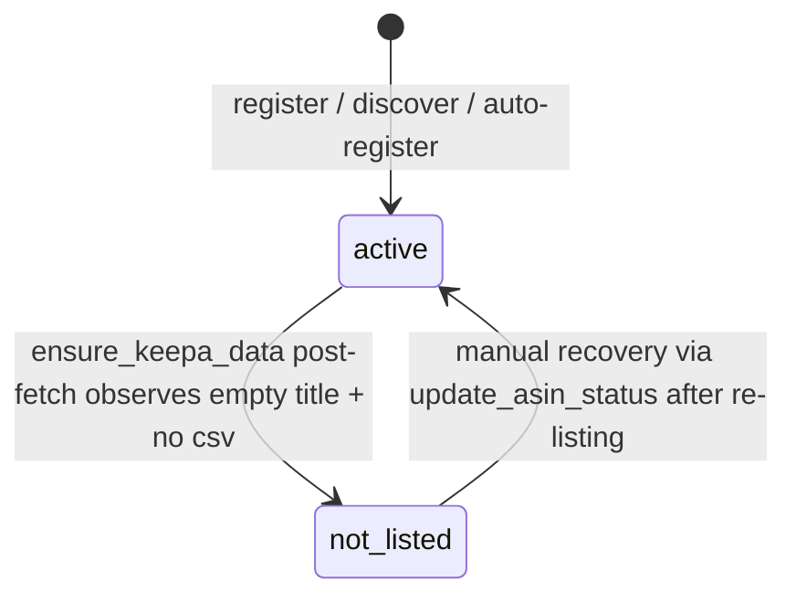

# Developer Reference

> Extracted from CLAUDE.md to reduce per-conversation token overhead.
> This file contains commands, architecture, schema, and conventions for human developers.

## Commands

```bash
# Install (editable mode)
pip install -e ".[dev]"

# ── Daily workflow (no config file needed — reads from DB) ──
amz-scout scrape -m UK                            # Scrape all DB products on UK
amz-scout scrape -p "RT-BE58" -m UK --headed -v   # Debug single product
amz-scout scrape -c "Travel Router"               # Scrape by category
amz-scout keepa -m UK                             # Smart Keepa fetch (default: 7-day cache)
amz-scout keepa --lazy                            # Use cache no matter how old
amz-scout keepa --fresh -m UK                     # Force re-fetch from API
amz-scout keepa --check -m UK                     # Show data freshness matrix
amz-scout keepa --budget                          # Show token balance
amz-scout discover -m UK                          # Find cross-marketplace ASINs (browser)
amz-scout status -m UK                            # CSV + DB + freshness overview

# ── Query (no config file needed) ──
amz-scout query latest -m UK
amz-scout query trends -p "RT-BE58" -m UK --series new
amz-scout query compare -p "RT-BE58"
amz-scout query ranking -m UK
amz-scout query sellers -p "RT-BE58" -m UK
amz-scout query deals -m UK

# ── Legacy YAML mode (still supported via --config) ──
amz-scout scrape --config config/BE10000.yaml -m UK
amz-scout keepa --config config/BE10000.yaml --check
amz-scout validate config/BE10000.yaml            # Validate config (YAML only)

# ── Admin (one-time operations) ──
amz-scout admin reparse config/BE10000.yaml       # Regenerate CSV from raw JSON (free)
amz-scout admin migrate config/BE10000.yaml       # Import legacy data into SQLite
amz-scout admin merge-dbs                         # Consolidate per-project databases

# Test
pytest                        # All tests
pytest tests/test_api.py      # API layer tests
pytest --cov=amz_scout        # With coverage

# Lint
ruff check src/ tests/        # Check
ruff check --fix src/ tests/  # Auto-fix
ruff format src/ tests/       # Format

# ── Deployment (Phase 6, production) ──
docker compose up -d --build          # Build + start webapp + Caddy edge
docker compose logs -f webapp         # Tail webapp logs
docker compose logs -f caddy          # Tail TLS / ACME logs
scripts/smoke_deploy.sh "$DOMAIN"     # End-to-end deploy smoke test
# Full runbook: deploy/README.md
```

## Architecture

```
api.py  ─────────────────────────  Programmatic API (strings in, dicts out)
  │                                  20+ public functions, no exceptions to caller
  │
cli.py  ─────────────────────────  Typer CLI (thin shell, delegates to api.py for queries)
  │
  ├─→ config.py                    YAML loading via Pydantic (ProjectConfig + MarketplaceConfig)
  │     reads: config/marketplaces.yaml + config/<project>.yaml
  │
  ├─→ scraper/keepa.py             KeepaClient: HTTP wrapper for Keepa API
  │     - 1 token/product (basic) or ~6 tokens/product (--detailed)
  │     - Auto-waits for token refill
  │     - Saves raw JSON to output/<project>/data/{region}/raw/
  │     - Parses → PriceHistory dataclass
  │
  ├─→ browser.py                   BrowserSession: subprocess wrapper around `browser-use` CLI
  │     └→ marketplace.py          Per-marketplace setup (cookies, delivery address, currency)
  │     └→ scraper/amazon.py       JS extraction from product pages → CompetitiveData dataclass
  │     └→ scraper/search.py       ASIN discovery via search fallback + auto-writeback to DB
  │
  ├─→ freshness.py                  Strategy evaluation (lazy/offline/max-age/fresh) — pure functions
  ├─→ keepa_service.py              Cache-first orchestration: check DB → read raw JSON or fetch API
  │
  ├─→ csv_io.py                    Read/write/merge CSVs (key: date+site+model)
  ├─→ db.py                        SQLite (WAL mode) with 6 tables, query functions for analysis
  └─→ models.py                    Frozen dataclasses: Product, CompetitiveData, PriceHistory
```

## Key Design Decisions

- **browser-use is a subprocess**, not a Python library. `BrowserSession` calls the CLI via `subprocess.run()`. One session persists per marketplace.
- **ASIN resolution has a 4-level fallback**: DB registry → config products → ASIN pass-through → error. Found ASINs are auto-written to the SQLite product registry (not YAML).
- **Keepa raw JSON is always saved** so `reparse` can regenerate CSVs without spending tokens.
- **All data models are frozen dataclasses** (immutable). CSV merge creates new lists rather than mutating.
- **Config uses Pydantic for validation**, data models use stdlib `dataclasses` — intentional split.

## Database Schema (db.py)

9 tables: **Data**: `competitive_snapshots` (browser), `keepa_time_series` (price arrays), `keepa_buybox_history`, `keepa_coupon_history`, `keepa_deals`, `keepa_products` (metadata + fetch_mode). **Product registry**: `products`, `product_asins` (per-marketplace ASIN + status), `product_tags`. Series types 0-35 follow Keepa's csv[] indices; 100 = monthly_sold, 200+ = category rankings.

### Migration History

| Version | Description | Notes |
|---------|-------------|-------|
| 1 | Initial schema | Baseline — `competitive_snapshots` + `keepa_*` tables |
| 2 | `project` column on `competitive_snapshots` | Per-project scoping |
| 3 | Product registry tables | `products`, `product_asins`, `product_tags` |
| 4 | `fetch_mode` on `keepa_products` | Track basic vs full fetches |
| 5 | Tighten `product_asins.status` CHECK | Drop zombie `'unavailable'` value |
| 6 | Remove intent validation | Collapse status to `active` / `not_listed` |
| 7 | Normalize brand/model matching | Add `brand_key`/`model_key` + `UNIQUE(brand_key, model_key)` on `products`; merges literal-variant duplicates on upgrade |
| 8 | Canonicalize `ean_list`/`upc_list` to GTIN-13 | Rewrite `keepa_products.ean_list` / `upc_list` JSON in place so UPC-12 and EAN-13 of the same physical product collide; no DDL |

**Partial-failure note (v7 ↔ v8 ordering)**: v7 runs outside the
inner migration txn because it toggles `PRAGMA foreign_keys`; v8 runs
inside. `_migrate` gates v7 by checking the actual `schema_migrations`
record (not `MAX(version)`) so a pre-v7 DB whose v8 record commits
before v7 fails will still retry v7 on reopen instead of treating
`current = 8` as "all migrations applied".

### Brand/Model Normalization (v7+)

`products.brand` and `products.model` store the first writer's literal
value for display. Identity matching uses the normalized
`products.brand_key` / `products.model_key` columns, populated by
`_normalize_key(s) = " ".join((s or "").lower().split())` (lowercase +
strip + internal-whitespace fold). This prevents Keepa's literal noise
(e.g. `'TP-Link'` vs `'TP-Link '` vs `'tp-link'`) from fracturing a
single physical product across multiple `product_id` rows.

The v7 migration merges any such pre-existing duplicates, keeping the
lowest `id` as canonical and re-pointing child rows in
`product_asins` / `product_tags` via `UPDATE OR IGNORE` + `DELETE`.
Conflicts where two duplicate products held an ASIN on the same
marketplace are logged at `WARNING` level for manual reconciliation.
The rebuild toggles `PRAGMA foreign_keys` off/on around the
`DROP TABLE products` + `RENAME products_v7 → products` sequence, per
SQLite's recommended 12-step migration pattern.

### GTIN Canonicalization (v8+)

`keepa_products.ean_list` and `keepa_products.upc_list` store canonical
GTIN-13 JSON arrays since schema v8. Both columns are passed through
`_normalize_gtin_list` on write (`_upsert_keepa_product`) and on read
(`_find_product_by_ean` re-normalizes lookup inputs for defence in
depth). `_normalize_gtin(code)` strips non-digit characters and
left-zero-pads to 13 digits; codes >13 digits or with no digits at all
collapse to `""` and are dropped so `codes.discard("")` removes them.

Rationale: Keepa dual-writes UPC-12 (`"850018166010"`) to `upc_list`
and EAN-13 (`"0850018166010"`, same GTIN with leading zero) to
`ean_list` for US GS1-registered products; European listings carry
only EAN-13. A raw string comparison misses these cross-format matches
and creates duplicate `product_id` rows for the same physical product.
Normalizing both sides to GTIN-13 closes the gap without adding new
indexes.

The v8 migration rewrites existing rows in place (JSON content only,
no DDL) and skips rows whose canonical form already equals the stored
form, so it is cheap and idempotent. Fresh databases seed the v8
`schema_migrations` record from `_SCHEMA_SQL` and skip the backfill
loop entirely.

Operator note: ad-hoc SQL that filters `upc_list`/`ean_list` with
`LIKE '%<digits>%'` still matches canonical GTIN-13 values (a 12-digit
UPC is a substring of its "0"+UPC GTIN-13 form). Strict equality
queries should use the canonical GTIN-13 form.

## ASIN Status Semantics

`product_asins.status` (since schema v6) is a 2-value enum. It tracks
**Amazon availability**, not user intent validation.

### Values

| Value | Meaning | Typical Trigger |
|-------|---------|-----------------|
| `active` | Default; queryable. Registered and not observed as delisted. | Default on insert; `add_product`, `discover_asin`, `_auto_register_from_keepa`, `register_asin` |
| `not_listed` | Observed empty-title response from Keepa (ASIN dead/removed on Amazon) | `_try_mark_not_listed()` during `ensure_keepa_data` post-fetch validation |

### Design Principle — Intent vs Availability

- **Intent errors** (user supplies ambiguous / wrong ASIN / model) → user's
  own input is the source; interactive users can spot the mismatch from the
  returned Keepa title and correct their query. No automated pre-validation
  needed.
- **Availability errors** (Amazon delisted the product) → external system is
  the source; user cannot tell "empty data" from "market-unavailable data"
  without a system signal. `not_listed` serves this purpose.

### Query Gate

`_resolve_asin` and `load_products_from_db` reject only `not_listed` —
`active` rows pass through. This prevents the silent-failure bug where
users would see "no data" when the real cause was a dead ASIN.

### State Diagram



### Single Write Entry Point

All status mutations should go through `update_asin_status()` (db.py).
Direct SQL updates bypass `last_checked` / `updated_at` bookkeeping.

### What's NOT in this column (deferred to Phase 3)

- **Monitoring on/off per user** — will live in a future
  `user_product_subscriptions` table
- **Validation freshness (stale)** — derive from `last_checked` timestamp at
  query time
- **Intent validation** — removed in v6; rely on interactive user review of
  Keepa titles. If future scale requires automation, use EAN/UPC matching
  (see `_find_product_by_ean`) rather than title fuzzy matching

## Config Structure

- `config/marketplaces.yaml` — 13 marketplace definitions (domain, Keepa codes, currency, region, postcode). **Only required YAML file.**
- **Keepa support**: 11 of 13 marketplaces have Keepa API support. AU and NL are browser-only (`keepa_domain_code: null`).
- `config/<project>.yaml` — **Legacy import format**, not required for daily operations. Use `import_yaml()` to migrate to DB.

## External Dependencies

- **browser-use CLI** (`uv tool install browser-use`) — not a pip dependency, called via subprocess
- **Keepa API** — requires `KEEPA_API_KEY` in `.env`; Pro plan = 60 tokens, 1/min refill

## Output Layout

```
output/
  ├── amz_scout.db                   # Shared SQLite database (product registry + all data)
  └── data/{region}/
      ├── raw/{site}_{asin}.json     # Keepa raw responses
      ├── {site}_competitive_data.csv  # Current Amazon page data
      └── {site}_price_history.csv     # Keepa 90-day price trends
```

- **Database is the single source of truth** for products, ASINs, and all Keepa/competitive data
- **Raw JSON and CSV** are per-region flat directories (no per-project nesting in DB-first mode)

Regions: `eu` (UK/DE/FR/IT/ES/NL), `na` (US/CA/MX), `apac` (JP/AU/IN), `sa` (BR)

## Conventions

- Python 3.12+, ruff for linting/formatting (line-length 100)
- Frozen dataclasses for all data models — never mutate, always create new
- `utils.py` contains parsers (price, rating, BSR) and a `@retry` decorator
- Marketplace setup logic in `marketplace.py` has per-country address handlers (standard EU, Canada 2-part postcode, Australia postcode+city)

## Webapp Envelope Trimming

trim 只发生在 `webapp/tools.py` 的 `_step_*` 包装器上，通过 `@trim_for_llm(...)` 装饰器把 `amz_scout._llm_trim` 的白名单套到 envelope 的 `data` 字段。`amz_scout.api` 本身**永远返回完整 DB 行**，CLI 和 admin 工具看到全量字段。

白名单:
- `trim_competitive_rows`: 13 字段（site/category/brand/model/asin/price_cents/currency/rating/review_count/bought_past_month/bsr/available/scraped_at）
- `trim_timeseries_rows`: date + value
- `trim_seller_rows`: date + seller_id
- `trim_deals_rows`: 8 字段（asin/site/deal_type/badge/percent_claimed/deal_status/start_time/end_time）

若需添加字段，编辑 `src/amz_scout/_llm_trim.py` 对应 frozenset，然后跑 `pytest tests/test_token_audit.py` 确认 cost delta 可接受。**绝不**把 trim 调用搬回 `amz_scout/api.py`。**meta 从不过滤**。
